# Capítulo 3. Planificación y Gestión

Este capítulo describe la planificación, ejecución y cierre del proyecto desde la perspectiva de gestión, complementando la perspectiva técnica del resto de la memoria. Su contenido se estructura según las recomendaciones de la asignatura *Dirección y Planificación de Proyectos Informáticos* y la práctica habitual del PMBOK 7.ª edición.

El proyecto se desarrolla en el contexto de un Trabajo de Fin de Grado, con un único recurso técnico (el autor) que asume todos los roles (analista, desarrollador, *tester* y redactor). Esta circunstancia simplifica drásticamente la OBS y la estructura de comunicación, pero no el plan de riesgos: el carácter experimental del trabajo —dependencia de proveedores externos de LLM, naturaleza estocástica de los resultados— hace que la identificación y el seguimiento de los riesgos sean actividades centrales de la gestión.

## 3.1 Planificación del proyecto

### 3.1.1 Identificación de interesados

Los interesados (*stakeholders*) del proyecto, ya identificados en §4.1 desde la perspectiva del sistema, se completan aquí con los actores del proyecto en sí:

- **Autor** (Daniel Uría Edroso, UO282813). Responsable único de análisis, diseño, implementación, validación y redacción.
- **Tribunal de defensa**. Responsable de la evaluación final del trabajo.
- **Usuarios finales potenciales**. Desarrolladores y arquitectos de datos que pudieran adoptar la herramienta en el futuro. No participan en el proyecto pero condicionan decisiones de diseño (RU-6.2 GUI para uso sin línea de comandos, RNF-3 usabilidad).
- **Comunidad científico-académica**. Lectores futuros de la memoria si el trabajo se publica o se reutiliza como base de proyectos posteriores.
- **Proveedores externos de LLM** (Google, Groq). No son interesados en sentido estricto pero condicionan la planificación: cuotas, retiradas de modelos y disponibilidad de la API impactan directamente en el plan de trabajo.

### 3.1.2 OBS y PBS

#### Estructura de descomposición de la organización (OBS)

La organización del proyecto es plana y única-recurso, lo que simplifica la OBS hasta hacerla trivial:

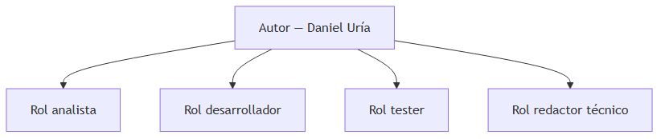

La OBS contiene un único recurso humano. Distinguir explícitamente sus cuatro **roles** —analista, desarrollador, *tester* y redactor técnico— resulta útil para el cálculo de costes (§3.1.5) y para la atribución de horas en el seguimiento (§3.2).

#### Estructura de descomposición del producto (PBS)

El proyecto entrega tres productos diferenciados:

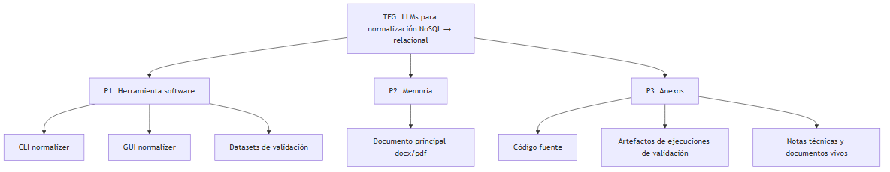

### 3.1.3 Planificación inicial. WBS y diagrama de Gantt

El proyecto se descompone en una fase inicial (F0) y nueve paquetes de trabajo (P1–P9) con un alto grado de paralelismo entre las actividades de desarrollo y las de redacción de la memoria. La fase inicial es secuencial (estudios previos → primer prototipo); a partir del primer prototipo, las iteraciones sobre la herramienta y la redacción de los capítulos correspondientes corren en paralelo. La metodología es **iterativa** más que estrictamente ágil: no hay *sprints* fijos sino entregables identificables al cierre de cada paquete.

La codificación jerárquica `n.m` (con `n` el paquete y `m` la actividad de nivel 3) materializa la trazabilidad entre niveles. Roles asumidos por el único recurso humano (ver OBS §3.1.2): **AN** analista, **DEV** desarrollador, **TST** *tester*, **DOC** redactor técnico. El esfuerzo agregado coincide con el presupuesto inicial (§3.1.5).

#### Índice de paquetes

| Cód. | Paquete | Inicio | Fin | Dur. (d) | Resp. | Entregable principal |
|---|---|---|---|---:|---|---|
| F0 | Inicio | 2026-02-02 | 2026-02-13 | 10 | AN | Cap. 1 borrador (descripción y alcance) |
| P1 | Estudios previos | 2026-02-16 | 2026-04-13 | 43 | AN | Diseño del *pipeline* multi-paso |
| P2 | Prototipo base del *pipeline* | 2026-04-16 | 2026-04-30 | 12 | DEV | End-to-end sobre Spruce |
| P3 | Abstracción del proveedor LLM | 2026-04-29 | 2026-05-22 | 18 | DEV | CLI multi-proveedor con `GoogleProvider` |
| P4 | Agente de descubrimiento | 2026-05-20 | 2026-06-02 | 14 | DEV | Selección autónoma sobre Spruce-URL |
| P5 | Segundo proveedor (Groq) | 2026-05-19 | 2026-05-27 | 7 | DEV | Multi-proveedor operativo |
| P6 | Validación experimental | 2026-05-28 | 2026-06-02 | 6 | TST | Cobertura UML sobre Habitica |
| P7 | Interfaz gráfica (GUI) | 2026-06-03 | 2026-06-15 | 9 | DEV | Tres casos validados desde la GUI |
| P8 | Memoria (transversal) | 2026-02-16 | 2026-06-17 | 88 | DOC | Documento final aprobado |
| P9 | Cierre y defensa | 2026-06-15 | 2026-06-25 | 8 | AN | Acta de defensa |

#### Diagrama de Gantt general

La distribución temporal de los nueve paquetes sobre el periodo del proyecto (febrero–junio de 2026) se muestra a continuación. Los paquetes técnicos (P1–P7) corren en serie hasta P3 y a partir de ahí muestran solapamiento por la naturaleza iterativa del trabajo; la memoria (P8) es transversal desde el inicio. El **camino crítico** recorre 0.2 → 1.5 → 2.6 → 3.7 → 4.7 → 6.5 → 7.4 → 8.11 → 9.4; las actividades 4.6 (iteración del *prompt* del agente) y 6.2 (validación sobre Habitica) concentran el riesgo de retraso por su naturaleza experimental, en línea con el riesgo R-04 (§3.1.4). Los solapamientos planificados entre P3 (abstracción) y P5 (Groq) son la principal palanca para acortar el plan general y materializan el principio arquitectónico de que "añadir un proveedor es un *copy-paste*" (cap. 5).

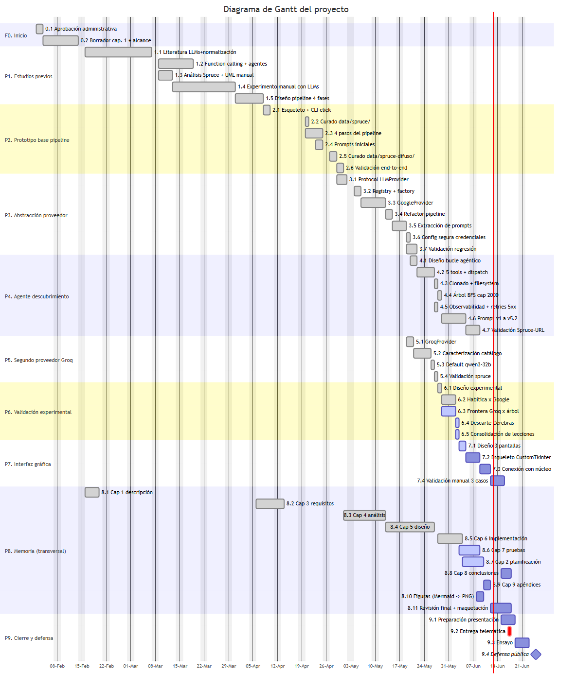

#### Descomposición por paquete

Los mini-Gantts siguientes detallan las actividades de nivel 3 dentro de cada paquete técnico (P1–P7) y de la memoria (P8). La fase F0 (Inicio) y el paquete P9 (Cierre y defensa) son lo bastante compactos como para describirlos solo en prosa: F0 cubre la aprobación administrativa del tema y la redacción inicial del cap. 1 (descripción general, objetivos y alcance), 10 días; P9 reúne la preparación de la presentación, la entrega telemática del trabajo el 2026-06-17, un ensayo previo y la defensa pública ante el tribunal el 2026-06-25.

**P1. Estudios previos.** Sienta las bases conceptuales del proyecto: revisión de literatura sobre LLMs aplicados a normalización, estado del arte de *function calling* y agentes con LLM, análisis del repositorio Spruce como dataset de referencia y experimento manual de extracción de DDL vía interfaz de *chat* con varios modelos comerciales de las familias GPT y similares. Cierra con el diseño preliminar del *pipeline* multi-paso de cuatro fases, que fija la arquitectura objetivo para P2.

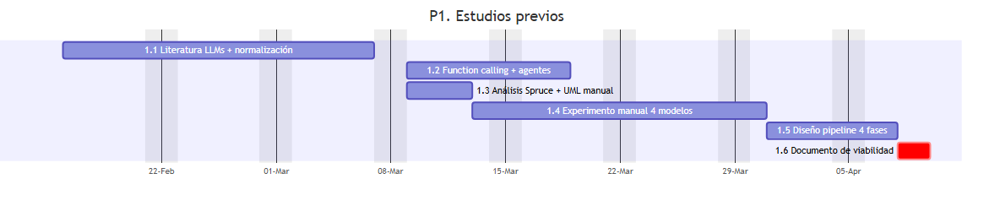

**P2. Prototipo base del *pipeline*.** Implementa el esqueleto del proyecto Python (módulo `normalizer`, CLI con *click*) y los cuatro pasos del *pipeline* (lectura, análisis, diseño relacional, generación de DDL Oracle). Cura los dos datasets de prueba (`data/spruce/` con *schemas* Mongoose explícitos y `data/spruce-difuso/` con evidencia heterogénea sin *schemas*) y valida la cobertura UML *end-to-end*. Cierra con el ajuste de `design.md` para incorporar la regla de reconciliación de FKs ante atributos redundantes.

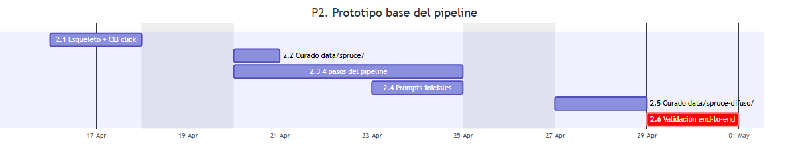

**P3. Abstracción del proveedor LLM.** Diseña la interfaz `LLMProvider` y las *dataclasses* neutras (`Message`, `ToolSpec`, `ToolCall`, `ChatResponse`), implementa el *registry* y la *factory* `build_provider(for_agent=...)` con dos modelos por proveedor (`DEFAULT_MODELS` para texto-a-texto, `DEFAULT_AGENT_MODELS` con *function calling*), implementa `GoogleProvider` sobre el SDK `google-genai` y *refactoriza* el *pipeline* para depender únicamente de la abstracción. Extrae los *prompts* a `normalizer/prompts/*.md` para hacerlos intercambiables sin tocar Python.

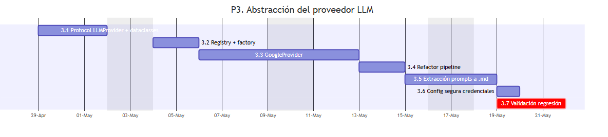

**P4. Agente de descubrimiento.** Diseña e implementa el bucle agéntico con *tool-use* nativo del SDK del proveedor, sus cinco herramientas (`list_dir`, `read_file`, `grep`, `select_evidence`, `done`) y el clonado de repositorios con caché local. Introduce el recorrido del árbol del repositorio en BFS con *cap* a 2 000 entradas (`build_tree_summary`), la observabilidad por *stderr* `[mm:ss]` y los reintentos extendidos a 5xx en `GoogleProvider`. Itera el *prompt* de sistema desde la v1 hasta la v5.2 (principio del hermano, dos pasadas obligatorias, *batching* como regla dura) y cierra con la validación autónoma sobre Spruce-URL — 4/4 *schemas* recuperados y 11/11 entidades en el DDL final.

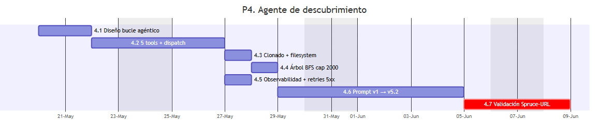

**P5. Segundo proveedor (Groq).** Implementa `GroqProvider` con el SDK OpenAI-compatible, caracteriza empíricamente el catálogo Groq para identificar qué modelos soportan *function calling* sin emisión de *markup* ni *chain-of-thought* no parseable (validados `qwen/qwen3-32b` y `meta-llama/llama-4-scout-17b-16e-instruct`; descartados Llama 3.x, `gpt-oss-20b/120b` y `groq/compound-*`), fija el modelo por defecto del agente Groq a `qwen/qwen3-32b` y valida *end-to-end* sobre `data/spruce/`.

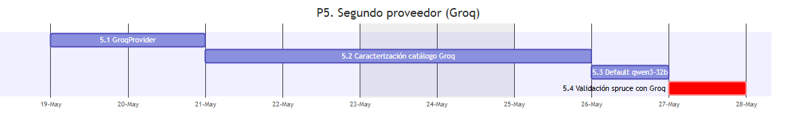

**P6. Validación experimental.** Define las métricas del paquete (cobertura UML, archivos seleccionados por iteración, *wall-clock*, 429s absorbidos por el *retry*), ejecuta el *run* completo sobre Habitica × Google (`gemini-3.1-flash-lite`, 2026-06-01), caracteriza la frontera Groq × tamaño del árbol (HTTP 413 con `qwen/qwen3-32b` 6 K TPM y `meta-llama/llama-4-scout` 30 K TPM sobre ~30–50 K *tokens* del árbol de Habitica), descarta Cerebras por el *cap* de contexto en *free tier* y consolida las lecciones aprendidas en el documento maestro de decisiones del proyecto.

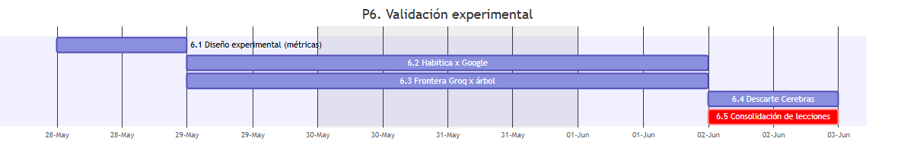

**P7. Interfaz gráfica (GUI).** Diseña las tres pantallas guiadas (configuración con entrada + proveedor + credenciales, ejecución con progreso por fases y tabla del agente, resultado con diagrama ER auto-generado + artefactos en pestañas), implementa el esqueleto con CustomTkinter y la navegación entre pantallas, conecta la GUI con el núcleo (`pipeline.py` y el agente de descubrimiento) y valida manualmente los tres casos de uso (`data/spruce/`, `data/spruce-difuso/`, Spruce-URL) reproduciendo desde la GUI los resultados obtenidos por CLI.

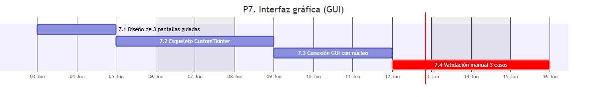

**P8. Memoria (transversal).** Redacta los nueve capítulos en ventanas inmediatamente posteriores al cierre del paquete técnico que documenta cada uno, salvo el cap. 2 (planificación y gestión), que requiere la traza completa del proyecto y se redacta hacia el final. Incluye la generación de figuras (Mermaid → PNG vía *build script*) y la revisión final ortográfica/gramatical y maquetación a `.docx` con Pandoc, hito que cierra el camino crítico del proyecto antes del paquete P9.

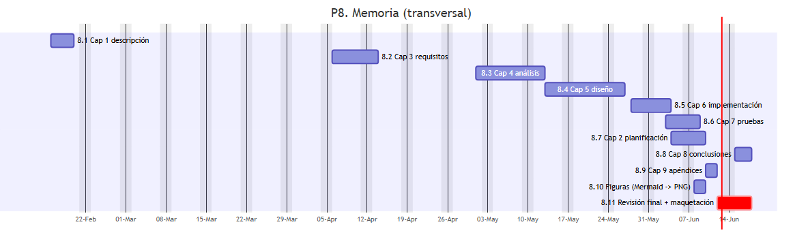

### 3.1.4 Riesgos

#### Plan de gestión de riesgos

La gestión de riesgos sigue las recomendaciones de la norma ISO 31000 ([4]) y de PMBOK 7. El procedimiento consta de cinco actividades: identificación, análisis cualitativo (probabilidad × impacto), planificación de la respuesta, seguimiento y registro. La política de aceptación se define en términos de **exposición** (P × I, escala 1–5 × 1–5 = 1–25):

- Exposición ≥ 12: riesgo **crítico**, plan de mitigación obligatorio antes de cualquier nueva tarea.
- Exposición entre 6 y 11: riesgo **alto**, plan de mitigación recomendado, contingencia preparada.
- Exposición entre 3 y 5: riesgo **moderado**, monitorizado con indicadores.
- Exposición ≤ 2: riesgo **bajo**, aceptado.

Las hojas individuales de cada riesgo, con su descripción completa, indicadores de materialización y plan de contingencia, se incluyen en el apéndice 10.1 conforme a la recomendación de la plantilla.

#### Identificación de riesgos

Se identifican doce riesgos, agrupados en tres categorías: **dependencia externa**, **técnico** y **calidad**. La planificación inicial no contempla riesgos genéricos de gestión (control de versiones, sobreesfuerzo) sino los específicos del dominio *LLM-as-a-service* que diferencian este proyecto de un desarrollo software clásico: dependencia de proveedores en evolución rápida, no determinismo del modelo, y madurez desigual de las APIs y SDKs.

| ID | Categoría | Descripción resumida |
|---|---|---|
| R-01 | Dependencia externa | Colapso de la cuota del *free tier* de Google. |
| R-02 | Técnico | Agotar cuota de uso de Groq *free tier* por el tamaño del árbol del repositorio en repositorios medianos. |
| R-03 | Técnico | Soporte irregular de *function calling* en los modelos *open-weight* hospedados por Groq. |
| R-04 | Calidad | Alta varianza del agente sobre el mismo *input*. |
| R-05 | Dependencia externa | Retirada o sustitución de modelos durante el desarrollo. |
| R-06 | Calidad | Diferencia significativa de cobertura entre proveedores sobre el mismo *input*. |
| R-07 | Dependencia externa | Suspensión o limitación de cuentas de proveedor por uso intensivo en pruebas. |
| R-08 | Dependencia externa | Cambios estructurales en las políticas de uso de los proveedores LLM (retirada del *free tier*, exigencia de verificación de pago, restricciones de uso académico, retirada simultánea de modelos demo-críticos) que invaliden el modelo de despliegue el día de la demostración pública. |
| R-09 | Técnico | Cambios incompatibles (*breaking changes*) en los SDKs cliente de los proveedores (`google-genai`, `groq`) entre versiones, en una fase de evolución rápida de su API. |
| R-10 | Técnico | Reenrutamiento silencioso del alias del modelo (*model aliasing*) por parte del proveedor: el identificador del modelo se mantiene pero el modelo subyacente cambia, alterando *outputs* entre *runs* aparentemente idénticos. |
| R-11 | Calidad | Sesgo del LLM hacia modelos relacionales convencionales que aplane denormalizaciones legítimas y pierda información presente en el modelo documental original. |
| R-12 | Calidad | *Drift* del *prompt* del agente: la iteración sobre un dataset concreto (Spruce) optimiza el *prompt* para ese caso y degrada la generalización a otros repositorios. |

#### Registro de riesgos (probabilidad × impacto inicial)

Los valores siguientes corresponden a la evaluación realizada al inicio del proyecto. La evolución del registro durante la ejecución se detalla en §3.2.3 y el cierre en §3.3.2.

| ID | Probabilidad | Impacto | Exposición | Estrategia | Categoría |
|---|---|---|---|---|---|
| R-01 | 4 | 5 | 20 | Mitigar | Crítico |
| R-02 | 3 | 4 | 12 | Mitigar | Crítico |
| R-03 | 4 | 3 | 12 | Mitigar | Crítico |
| R-04 | 5 | 3 | 15 | Aceptar / Mitigar parcial | Crítico |
| R-05 | 3 | 3 | 9 | Mitigar | Alto |
| R-06 | 4 | 2 | 8 | Aceptar | Alto |
| R-07 | 2 | 3 | 6 | Aceptar | Alto |
| R-08 | 3 | 4 | 12 | Mitigar | Crítico |
| R-09 | 3 | 3 | 9 | Mitigar | Alto |
| R-10 | 2 | 2 | 4 | Mitigar | Moderado |
| R-11 | 4 | 2 | 8 | Mitigar | Alto |
| R-12 | 3 | 3 | 9 | Mitigar | Alto |

### 3.1.5 Presupuesto inicial

#### Presupuesto de costes

El proyecto no tiene cliente externo: el coste se calcula como horas de trabajo del autor. La estimación inicial considera 300 horas efectivas distribuidas entre los cuatro roles. Los costes por hora se toman del baremo recomendado para TFG por la propia plantilla (líneas 142–144 del extracto oficial), ajustado a tarifas habituales del mercado para perfiles junior en cada rol.

| Concepto | Horas | €/h | Coste estimado |
|---|---:|---:|---:|
| Autor — rol analista (P1, requisitos, diseño) | 80 | 30 | 2 400 € |
| Autor — rol desarrollador (P2–P7) | 140 | 25 | 3 500 € |
| Autor — rol tester (validación cualitativa) | 30 | 22 | 660 € |
| Autor — rol redactor técnico (P8) | 50 | 22 | 1 100 € |
| Infraestructura *cloud* (*free tier* Google + Groq) | — | — | 0 € |
| *Hardware* (equipo propio del autor, amortización despreciable) | — | — | 0 € |
| **Total estimado** | **300** | | **7 660 €** |

#### Presupuesto de cliente

No aplica: el proyecto es académico, sin cliente externo.

## 3.2 Ejecución del proyecto

### 3.2.1 Plan de seguimiento de la planificación

El seguimiento se materializa mediante tres **líneas base** que registran el estado de la planificación al cierre de hitos significativos. Las líneas base se reconstruyen a partir de la traza disponible en el repositorio del proyecto: `git log` (commits con fechas exactas) y los documentos vivos del directorio `notes/`, fechados explícitamente.

| Línea base | Fecha de corte | Estado |
|---|---|---|
| **LB-0. Planificación inicial** | 2026-02-15 | WBS, riesgos y presupuesto descritos en §3.1, antes de iniciar el desarrollo. |
| **LB-1. Línea base intermedia** | 2026-05-25 | Post-implementación del segundo proveedor (Groq) y primera validación experimental del agente de descubrimiento sobre Habitica. Confirmación de la viabilidad técnica del prototipo. |
| **LB-2. Línea base de cierre del prototipo** | 2026-06-01 | Cierre técnico de los paquetes P1–P6 y consolidación de las lecciones aprendidas. Inicio del paquete P7 (GUI). |

### 3.2.2 Bitácora de incidencias del proyecto

La bitácora siguiente recoge los eventos relevantes acaecidos durante la ejecución, correlacionados con los *commits* del repositorio que los cierran y con los riesgos identificados que materializan.

| Fecha | Evento | Riesgo | Commit / referencia |
|---|---|---|---|
| 2026-04-28 | Primer esqueleto del prototipo y borrador inicial del documento maestro de decisiones del proyecto. | — | `d37ce4e`, `83f33f6` |
| 2026-04-29 | Versión 0.2.0: el proveedor de LLM se puede elegir; *pipeline* desacoplado de Spruce. Datasets `spruce` y `spruce-difuso` consolidados. | — | `9f97ce2`, `867b545`, `4becf01` |
| 2026-05-24 | Primer *commit* del agente de descubrimiento; *fixes* post-validación. | — | `daf255b`, `8010b0e` |
| 2026-05-25 | Extracción de *prompts* a `normalizer/prompts/*.md`. | — | `f497393` |
| 2026-05-25 | Implementación del `GroqProvider` con SDK OpenAI-compatible. | — | `4946e05` |
| 2026-05-25 | Caracterización experimental: *gpt-oss-120b* descartado por *chain-of-thought* no parseable. | R-03 (materializado) | `29cb93d` |
| 2026-05-25 | Fijado modelo por defecto del agente Groq a `qwen/qwen3-32b`. | R-03 (mitigado) | `d623752` |
| 2026-05-25 | Documentación pública del colapso del *free tier* de Google y catálogo de alternativas. | R-01 (materializado) | `d560863` |
| 2026-05-25 | Adopción de `gemini-3.1-flash-lite` (500 RPD) como modelo por defecto del agente Google. | R-01 (mitigado) | `1668d91` |
| 2026-05-25 | Prompt v4 del agente + ampliación de `MAX_ITERS` y `MAX_FILES` a 30. Primera validación en Habitica. | R-04 (mitigado parcial) | `6f7db5f` |
| 2026-05-25 | Trace turno-a-turno + prompt v5 (dos pasadas obligatorias + *batching*). | R-04 (mitigado parcial) | `f5da046` |
| 2026-05-25 | Sustitución del recorrido DFS por BFS en `build_tree_summary`, con *cap* a 2 000 entradas. | R-02, R-04 | `fce52b2` |
| 2026-05-25 | Observabilidad por *stderr* con sello `[mm:ss]`. Reintentos de Google extendidos a 5xx. | RNF-2.2 | `137f416` |
| 2026-06-01 | Prompt v5.2 (pasada declarativa multi-*stack*); validación cruzada Spruce + Habitica para acotar el *drift* del *prompt*. | R-04, R-12 | `5897106` |
| 2026-06-01 | Run completo Habitica × Google: cobertura satisfactoria; frontera Groq confirmada. Consolidación de lecciones. | R-02, R-04, R-06 | `eadfc35` |
| 2026-06-02 | Inicio del paquete P7 (GUI). | — | — |

### 3.2.3 Riesgos durante la ejecución

A continuación se detallan, en formato de hoja de riesgo, los cinco riesgos cuya materialización o evolución condicionó significativamente la ejecución del proyecto. El registro completo de los doce se consolida en el apéndice 10.1.

#### Hoja de riesgo R-01 — Colapso del *free tier* de Google

| Campo | Valor |
|---|---|
| Descripción | El proveedor Google reduce drásticamente la cuota *free* de sus modelos Gemini en diciembre de 2025: `gemini-2.0-flash` queda con `limit: 0` y `gemini-2.5-flash-lite` con 20 peticiones por día, insuficientes para un agente que consume ~30 peticiones por sesión. |
| Categoría | Dependencia externa. |
| Probabilidad / Impacto / Exposición | 4 / 5 / 20 — Crítico. |
| Estrategia | Mitigar mediante implementación de un segundo proveedor (Groq) y mediante migración al nuevo modelo `gemini-3.1-flash-lite` (15 RPM / 250K TPM / 500 RPD) cuando se libera. |
| Indicadores | Cuotas devueltas en errores 429; documentación oficial del proveedor; mediciones empíricas (notes/2026-05-25-free-tier-google-y-alternativas.md). |
| Estado | **Materializado y mitigado.** Mantener vigilancia sobre futuros cambios de cuota. |

#### Hoja de riesgo R-02 — Frontera Groq × tamaño del árbol

| Campo | Valor |
|---|---|
| Descripción | El árbol del repositorio que el agente recibe en su primer mensaje supera el *tokens per minute* del *free tier* de Groq sobre repositorios medianos+. `qwen/qwen3-32b` (6 K TPM) y `meta-llama/llama-4-scout-17b-16e-instruct` (30 K TPM) devuelven HTTP 413 sobre el árbol BFS de Habitica (~30–50 K *tokens*). |
| Categoría | Técnico. |
| Probabilidad / Impacto / Exposición | 3 / 4 / 12 — Crítico. |
| Estrategia | Mitigar mediante uso de Google para el agente en repositorios medianos+ y reservar Groq para el *pipeline* texto-a-texto (que sí cabe en TPM). Documentar el *trade-off* en la documentación interna del proyecto y en la memoria. |
| Indicadores | HTTP 413; conteo de *tokens* del árbol antes de invocar. |
| Estado | **Materializado y aceptado** como límite del *free tier*. Se documenta como ampliación futura el uso del *dev tier* de Cerebras (sin *cap* diario). |

#### Hoja de riesgo R-04 — Alta varianza del agente

| Campo | Valor |
|---|---|
| Descripción | Sobre el mismo *input* (Habitica, mismo *prompt*, mismo modelo) se observan ejecuciones del agente con entre 5 y 22 archivos seleccionados. La varianza es propiedad latente del modelo y no se elimina con iteraciones del *prompt*. |
| Categoría | Calidad. |
| Probabilidad / Impacto / Exposición | 5 / 3 / 15 — Crítico. |
| Estrategia | Mitigar mediante (i) iteración del *prompt* con regla dura de *batching*, principio del hermano, dos pasadas obligatorias; (ii) reducción del techo de varianza con árbol BFS *cap* 2 000; (iii) documentación honesta del fenómeno en la memoria (rango, no número único). Aceptar el residuo. |
| Indicadores | Rango observado de archivos / iteraciones por *run*; cobertura mínima sobre el modelo de referencia. |
| Estado | **Reducido** pero no eliminado. La defensa del trabajo asume y documenta este límite. |

#### Hoja de riesgo R-05 — Retirada o sustitución de modelos durante el desarrollo

| Campo | Valor |
|---|---|
| Descripción | Los proveedores LLM retiran o sustituyen modelos a un ritmo más rápido que el ciclo de vida del proyecto. Un modelo *baseline* del prototipo (Gemma 3 en Google, *gpt-oss* en Groq, etc.) puede dejar de estar disponible antes de la entrega, o un modelo nuevo puede sustituir al anterior con cambios sutiles de comportamiento. |
| Categoría | Dependencia externa. |
| Probabilidad / Impacto / Exposición | 3 / 3 / 9 — Alto. |
| Estrategia | Mitigar mediante (i) abstracción `LLMProvider` que aísla el resto del sistema del cambio (RU-4.2); (ii) variables `DEFAULT_MODELS` y `DEFAULT_AGENT_MODELS` centralizadas en `providers/__init__.py` que permiten cambiar el modelo por defecto en una sola línea; (iii) vigilancia activa de los anuncios del proveedor durante la ventana del proyecto. |
| Indicadores | Cambios anunciados en la página oficial del proveedor; errores `404 model not found`; cambios en los *changelogs* del SDK; mensajes de *deprecation* en *stderr*. |
| Estado | **Materializado y mitigado.** Gemma 3 retirada en mayo de 2026; sustitución por `gemma-4-31b-it` (pipeline) sin cambios en `pipeline/pipeline.py` ni en los *prompts*. |

#### Hoja de riesgo R-08 — Cambios estructurales en políticas de uso del proveedor

| Campo | Valor |
|---|---|
| Descripción | Diferente de R-01 (cuota numérica reducida) y R-07 (suspensión de la cuenta individual): R-08 es un **cambio estructural de política** del proveedor que afecta a todos los usuarios del *free tier* (retirada completa del *tier* gratuito, exigencia de verificación de pago, restricciones geográficas, ToS no compatibles con uso académico, retirada simultánea de los modelos demo-críticos). El escenario crítico es que se materialice el día de la demostración pública del TFG: el sistema funciona durante todo el desarrollo y deja de funcionar justo en la defensa. |
| Categoría | Dependencia externa. |
| Probabilidad / Impacto / Exposición | 3 / 4 / 12 — Crítico. La probabilidad no es despreciable porque Google ya ha protagonizado un cambio así en diciembre de 2025 (R-01 materializado); la dependencia simultánea de los dos proveedores reduce pero no elimina la exposición. |
| Estrategia | Mitigar mediante (i) **snapshot offline** del *run* canónico de Spruce y Habitica grabado con anticipación a la defensa (PNGs del DDL, trazas del agente, *prompts* y *outputs* en disco), utilizable como demo de respaldo sin invocar al proveedor; (ii) preparación de la presentación con un *fallback* claramente comunicable al tribunal si el sistema en vivo no responde; (iii) multi-proveedor reduce la exposición frente a un único cambio de política — la materialización simultánea en Google y Groq es menos probable que en uno solo. |
| Indicadores | Anuncios oficiales del proveedor; cambios en ToS; foros y subreddits del SDK; cambios bruscos en la respuesta de la API en días previos a la defensa. |
| Estado | **No materializado** a fecha de cierre del prototipo. Snapshot offline preparado como contingencia para la defensa. |

## 3.3 Cierre del proyecto

### 3.3.1 Planificación final

La planificación final coincide en sus paquetes con la planificación inicial: no se han añadido ni retirado paquetes del WBS. La diferencia entre lo planificado y lo realizado se concentra en el esfuerzo invertido en tres paquetes técnicos:

- **Paquete P3 (Abstracción de proveedor)** consumió más horas de las previstas (~ +25 %), por la necesidad de iterar sobre la forma de la abstracción para que cupiera `GroqProvider` sin distorsionar `GoogleProvider`. La inversión amortizó con creces: añadir el segundo proveedor (P5) llevó menos de un día.
- **Paquete P4 (Agente de descubrimiento)** consumió aproximadamente +50 % de las horas previstas por la cantidad de iteraciones del *prompt* necesarias para reducir la alta varianza del agente sobre repositorios reales. Es la fuente principal del *overrun* del proyecto.
- **Paquete P6 (Validación experimental)** se materializó como una serie de *runs* sobre repositorios reales en lugar de como un esfuerzo puntual. Su carácter exploratorio justifica el sobrecoste.

El conjunto del proyecto se cierra dentro del plazo académico de defensa absorbiendo el sobrecoste de P4 con horas adicionales del autor (~ +35 h respecto al presupuesto inicial, §3.3.3) y aprovechando los solapamientos planificados entre paquetes técnicos y la memoria.

### 3.3.2 Informe final de riesgos

| ID | Estado final | Comentario |
|---|---|---|
| R-01 | Materializado y mitigado | El cambio a `gemini-3.1-flash-lite` y la implementación de Groq resolvieron la cuota. |
| R-02 | Materializado y aceptado | Documentado el *trade-off* y reservado Groq para el *pipeline* texto-a-texto. |
| R-03 | Materializado y mitigado | `qwen/qwen3-32b` y `meta-llama/llama-4-scout` validados; Llama 3.x, *gpt-oss-20b/120b* y `groq/compound-*` descartados. |
| R-04 | Reducido y aceptado | Mitigado con *prompt* v5.2 (dos pasadas obligatorias + *batching*) y árbol BFS *cap* 2 000; rango observado (5–22 archivos) documentado honestamente. |
| R-05 | Materializado y mitigado | Gemma 3 retirada en mayo de 2026; sustitución por `gemma-4-31b-it` sin pérdida funcional. |
| R-06 | Materializado y aceptado | Documentado el *trade-off* Google (calidad sobre Habitica) ↔ Groq (velocidad sobre *pipeline* texto-a-texto). |
| R-07 | No materializado | Sin incidencias de cuenta en ninguno de los dos proveedores durante el proyecto. |
| R-08 | No materializado | Sin cambios estructurales de política durante la ventana del proyecto. Snapshot offline preparado como contingencia para la defensa. |
| R-09 | No materializado | Versiones de `google-genai` y `groq` fijadas; un único *bump* de versión durante el proyecto (compatible). |
| R-10 | No materializado | Sin discrepancias observadas en *runs* idénticos. Mitigado preventivamente fijando IDs de modelo explícitamente versionados cuando disponibles. |
| R-11 | Reducido | Mitigado en el *prompt* del paso 2 (`analyze.md`) y en la regla de reconciliación de FKs de `design.md`; trazabilidad RU-2.3 permite detección humana del aplanamiento residual. |
| R-12 | Reducido | Mitigado mediante validación cruzada del *prompt* en dos datasets (`data/spruce/` y Habitica) en cada iteración significativa; *drift* hacia Mongoose explícitamente atacado en *prompt* v5.2. |

### 3.3.3 Presupuesto final de costes

| Concepto | Horas finales | €/h | Coste final | Δ vs inicial |
|---|---:|---:|---:|---|
| Autor — rol analista | 75 | 30 | 2 250 € | −5 h |
| Autor — rol desarrollador | 175 | 25 | 4 375 € | +35 h |
| Autor — rol tester | 40 | 22 | 880 € | +10 h |
| Autor — rol redactor técnico | 70 | 22 | 1 540 € | +20 h |
| Infraestructura *cloud* | — | — | 0 € | — |
| **Total final** | **360** | | **9 045 €** | **+60 h / +1 385 €** |

El sobrecoste real (~18 %) es coherente con el *overrun* observado en P4 (agente). El uso exclusivo del *free tier* de los proveedores mantiene los costes de infraestructura en cero.

### 3.3.4 Informe de lecciones aprendidas

Las lecciones aprendidas durante el proyecto, ordenadas por su valor para trabajos futuros similares, son las siguientes.

**L1. El modelo es el techo del agente, no el *prompt*.** Iterar sobre el *prompt* mejora el resultado pero hay un techo ligado a la capacidad del modelo para honrar instrucciones complejas. Sobre el mismo *prompt*, Gemini supera a Qwen3-32B, que supera a Llama 4 Scout, que supera a Llama 3.x. La consecuencia operativa: invertir tiempo en *prompt engineering* tiene rendimientos decrecientes una vez se exprime el modelo elegido.

**L2. La abstracción de proveedor amortiza pronto si se diseña con dos modelos por proveedor.** Distinguir desde el principio entre el modelo del *pipeline* (texto a texto, barato) y el del agente (con *function calling*, más capaz) anticipa decisiones que de otro modo se tomarían sobre la marcha y se documentan mal.

**L3. *Function calling* nativo > bucle JSON manual.** El SDK del proveedor entrena el formato; intentar replicarlo con JSON parseado de la salida textual es frágil incluso con modelos grandes.

**L4. *Free tier* dimensionado para una sola ejecución diaria.** En Google, 500 RPD ≈ ~15 sesiones del agente; en Groq la frontera la pone el TPM sobre el árbol del repositorio. Planificar el trabajo asumiendo cuotas escasas y diseñar los presupuestos del agente (`max_iters`, `max_files`) en consecuencia.

**L5. Recorrido por anchura (BFS) en el árbol del repositorio.** Una primera implementación con DFS hacía invisible al agente directorios de primer nivel cuando otros se profundizaban antes. Cambiar a BFS con *cap* a 2 000 entradas garantiza la visibilidad de todos los directorios *top-level* y resuelve el problema con un coste de complejidad insignificante.

**L6. Observabilidad como inversión temprana.** El registro `[mm:ss]` por la salida de error estándar, instrumentado en el CLI, el *pipeline*, el agente y los proveedores, fue determinante en la depuración del agente y en el diagnóstico de la frontera Groq. Una hora de trabajo amortizada cien veces.

**L7. Honestidad estadística defiende mejor que la magnificación.** Presentar el rango observado de cobertura del agente sobre Habitica (5 a 22 archivos) ayuda a la defensa más que un único número favorable; el tribunal valora el rigor metodológico.

---

**Referencias del capítulo**

[4] ISO 31000:2018 — *Risk management — Guidelines.*

[5] Project Management Institute, *A Guide to the Project Management Body of Knowledge (PMBOK Guide)*, 7.ª edición, 2021.
