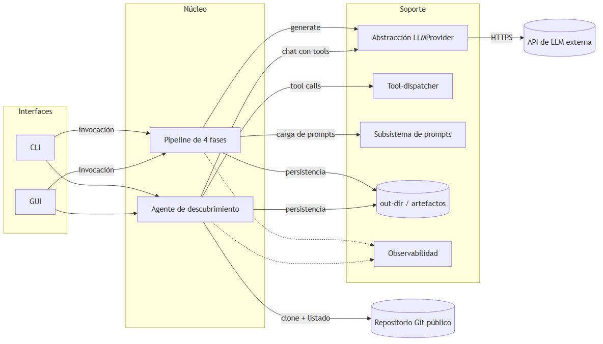
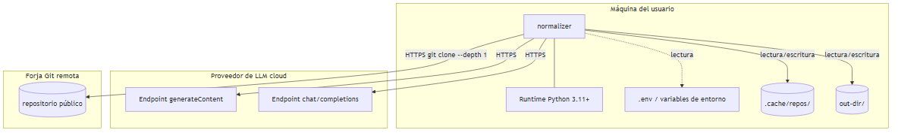
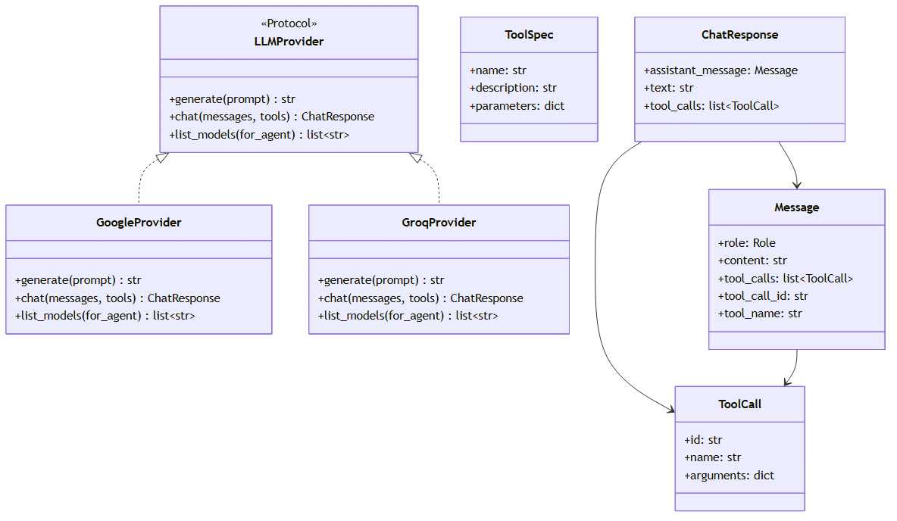
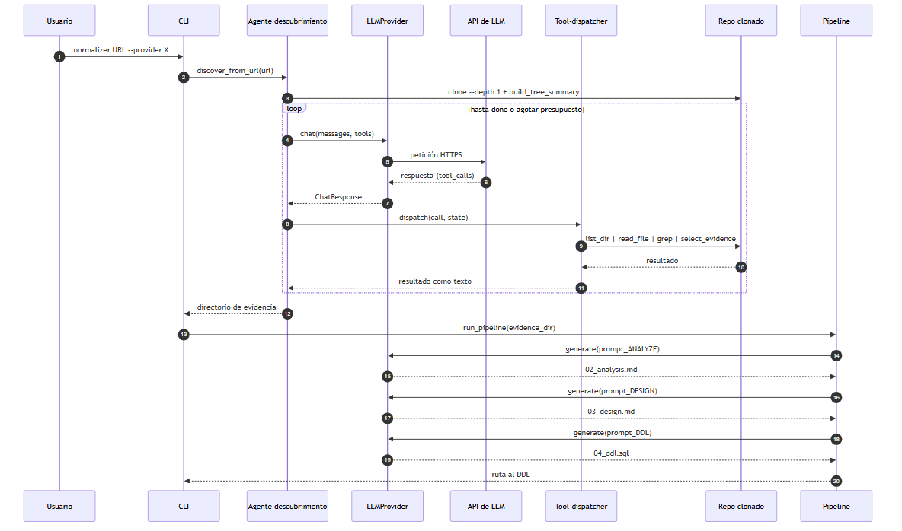

# Capítulo 5. Diseño

Este capítulo describe el diseño del sistema a partir de los requisitos enunciados en el capítulo 4. Se organiza en tres apartados: la **arquitectura general** (5.1) describe los componentes lógicos del sistema y su despliegue; el **diseño de detalle** (5.2) explica la estructura interna del código, el flujo de ejecución y los patrones de diseño empleados; y el **diseño de pruebas** (5.3) define qué se prueba en cada subsistema, sobre la base del plan de pruebas presentado en §4.3.

## 5.1 Diseño de la arquitectura

### 5.1.1 Visión general

El sistema es una **aplicación de escritorio mono-proceso** que orquesta llamadas a APIs externas de modelos de lenguaje y produce, como salida, un conjunto de artefactos persistentes en el sistema de archivos local. No expone ningún servicio remoto: cada invocación es autocontenida y se ejecuta sobre la máquina del usuario.

El núcleo de la herramienta es un **pipeline lineal de cuatro fases** —lectura, análisis del modelo documental, diseño relacional y generación de DDL— que transforma una colección heterogénea de evidencias documentales en un esquema relacional normalizado expresado en SQL compatible con Oracle. Cada fase recibe el artefacto producido por la anterior, persiste su propia salida en disco y se invoca con un *prompt* externalizado en un fichero independiente.

El sistema soporta **tres modos de entrada** —fichero único, directorio curado y URL de repositorio público— que convergen en el mismo *pipeline*. Cuando la entrada es una URL, el sistema delega la selección de las evidencias en un **agente de descubrimiento** que clona el repositorio, lo explora mediante un conjunto acotado de herramientas (*function calling*) y entrega al *pipeline* el subconjunto de archivos relevante.

La interacción con cualquier proveedor de LLM se realiza a través de una **abstracción común** que aísla al *pipeline* y al agente del SDK concreto del proveedor. Esto permite alternar proveedores (Google, Groq y, por extensión, cualquier otro) sin modificar el resto del sistema, y elegir en cada ejecución qué modelo concreto utiliza cada uno de los dos subsistemas que invocan al LLM: el *pipeline*, que requiere únicamente generación de texto, y el agente, que requiere además capacidad de *function calling*.

El sistema ofrece **dos interfaces equivalentes**: una interfaz de línea de comandos para usuarios técnicos y para la integración en *pipelines* automatizados, y una interfaz gráfica para usuarios no técnicos. La GUI es estrictamente una capa de presentación: invoca los mismos puntos de entrada del núcleo que el CLI sin duplicar lógica, lo que materializa el requisito de paridad funcional RF-6.3.

El estilo arquitectónico combina **pipes-and-filters** para la cadena de transformación (cada fase es un filtro con entrada y salida bien definidas) con un **agente** independiente para la tarea de exploración de repositorios, que no admite una formulación lineal.

### 5.1.2 Diagrama de bloques general

**Interfaces.** El sistema ofrece dos puntos de entrada equivalentes: una **interfaz de línea de comandos** orientada a usuarios técnicos y a la integración en *pipelines* automatizados, y una **interfaz gráfica** orientada al usuario no técnico, que permite seleccionar la fuente, configurar el proveedor, seguir el avance de la ejecución, inspeccionar los artefactos intermedios y exportar el resultado final. La equivalencia funcional entre CLI y GUI es un requisito explícito (RF-6.3): toda capacidad expuesta por la GUI puede ejecutarse también desde la CLI, porque la GUI invoca los mismos puntos de entrada del núcleo.

**Núcleo.** El **pipeline** concentra la lógica de transformación principal. El **agente de descubrimiento** se activa exclusivamente en el modo URL: clona el repositorio en una caché local, recibe del sistema un árbol filtrado del repositorio y, mediante un bucle de *function calling*, decide qué archivos contienen evidencia útil del modelo documental.

**Soporte.** La **abstracción `LLMProvider`** uniformiza el acceso al LLM mediante tres operaciones: una para generación de texto (utilizada por el *pipeline*), una para diálogo con herramientas (utilizada por el agente) y una auxiliar para listar el catálogo de modelos disponibles del proveedor (utilizada por la GUI para poblar dinámicamente los selectores de modelo sin necesidad de cerrar el catálogo en código). El **tool-dispatcher** materializa, del lado Python, las decisiones que el LLM expresa como invocaciones de herramientas; encapsula las herramientas de exploración del repositorio. El **subsistema de prompts** mantiene los *prompts* de cada fase como ficheros Markdown editables sin necesidad de modificar el código. La **persistencia** se materializa en un directorio de salida específico por ejecución, donde se almacenan todos los artefactos intermedios y finales. La **observabilidad** consiste en un registro estructurado por la salida de error estándar que marca el inicio y el fin de cada fase con un sello de tiempo relativo al arranque del proceso, complementado con un mecanismo de *callbacks* que la GUI consume sin parsear *stderr*.

**Sistemas externos.** El sistema interactúa con dos categorías de servicios externos: las **APIs de proveedores de LLM**, accedidas por HTTPS, y los **repositorios Git públicos**, accedidos mediante un cliente Git local con clonado superficial (`--depth 1`) para minimizar el tráfico.

### 5.1.3 Diagrama de despliegue

Todo el cómputo del sistema se concentra en la **máquina del usuario**, sobre la que se instala el paquete `normalizer` y un *runtime* de **Python 3.11 o superior**. El estado persistente se reparte en dos directorios bien acotados: una **caché de repositorios clonados** (`.cache/repos/`), que evita reclonar repositorios entre ejecuciones consecutivas, y un **directorio de salida** (`out-dir/`) específico para cada ejecución, donde se materializan los artefactos del *pipeline* y, en su caso, la traza del agente de descubrimiento. Las credenciales de los proveedores de LLM se inyectan a través de **variables de entorno**, opcionalmente cargadas desde un fichero `.env` que no debe versionarse en el repositorio del proyecto.

Las dependencias externas del sistema son dos: el **proveedor de LLM** —que expone los dos endpoints utilizados, uno por cada operación de la abstracción `LLMProvider`— y la **forja Git remota** que aloja el repositorio del usuario. Ambas se acceden por HTTPS; el sistema no realiza modificaciones sobre ninguna de las dos.

### 5.1.4 Decisiones arquitectónicas

La arquitectura presentada se sustenta en un conjunto de decisiones cuya justificación se enuncia a continuación, cada una acompañada de su traza al requisito correspondiente.

- **Aplicación mono-proceso y local.** El sistema se concibe como una herramienta de apoyo individual, no como un servicio multiusuario. Esta decisión reduce drásticamente la complejidad arquitectónica (no hay autenticación, control de sesiones ni concurrencia) y permite que la totalidad de los datos del usuario permanezca en su máquina. *Traza: RU-6, RU-7, RNF-3.*

- **Estilo *pipes-and-filters* en el *pipeline* con artefactos persistentes por fase.** Cada una de las cuatro fases es un filtro con una entrada y una salida bien definidas, y persiste su salida como un fichero independiente en el directorio de salida. Esto facilita la inspección por parte del usuario, el diagnóstico de fallos a nivel de fase y la reanudación parcial de una ejecución interrumpida. *Traza: RU-2, RU-3, RU-7, RF-2.*

- **Agente con *function calling* nativo del SDK.** Las decisiones del LLM sobre qué herramienta invocar se canalizan a través del mecanismo estructurado de *function calling* que ofrece cada SDK, en lugar de un esquema de respuesta JSON parseado a mano. Este enfoque es más robusto frente a desviaciones de formato del modelo y aprovecha el entrenamiento específico que los proveedores realizan sobre este canal. *Traza: RF-3, RF-4.4.*

- **Abstracción de proveedor mediante un *Protocol* en lugar de una jerarquía de herencia.** La interfaz `LLMProvider` se declara como un protocolo estructural, no como una clase base abstracta. Esto permite añadir nuevos proveedores sin acoplarlos a una jerarquía existente y mantiene el *pipeline* y el agente totalmente desacoplados del SDK concreto. *Traza: RU-4, RF-5.1, RF-5.2.*

- **Dos modelos distintos por proveedor: uno para el *pipeline* y otro para el agente.** El *pipeline* necesita únicamente capacidad de generación de texto; el agente, además, *function calling*. La selección de modelos por defecto distingue ambos casos, lo que permite combinar un modelo barato y rápido para el *pipeline* con uno más capaz para el agente. *Traza: RF-5.*

- **Prompts externalizados como ficheros Markdown.** Los *prompts* de cada fase del *pipeline* y el *prompt* de sistema del agente residen en `normalizer/prompts/*.md` y se cargan en tiempo de importación. Esto desacopla la iteración sobre los *prompts* —que es frecuente durante el desarrollo— de los cambios en el código Python. *Traza: RF-2.7.*

- **Confinamiento del agente al directorio temporal del repositorio clonado.** Las herramientas de acceso al sistema de archivos disponibles para el agente rechazan cualquier ruta que escape del directorio donde se ha clonado el repositorio analizado o del directorio de salida de la ejecución. Esto evita que el agente, ya sea por un error del modelo o por una invocación intencionada, acceda a información ajena a la tarea. *Traza: RF-4.2, RNF-4.2.*

- **Credenciales de los proveedores fuera del código.** Las claves de API no aparecen en el código fuente ni en el repositorio versionado; se inyectan a través de variables de entorno cargadas opcionalmente desde un fichero `.env` local. *Traza: RU-4.3, RNF-4.1.*

- **Aislamiento de ejecuciones por directorio de salida.** Cada invocación recibe (o adopta por defecto) un directorio de salida distinto. El sistema nunca asume que un directorio se reutiliza entre ejecuciones, lo que evita interferencias entre experimentos paralelos. *Traza: RU-7.2, RF-2.6.*

### 5.1.5 Trazabilidad arquitectura ↔ requisitos

La tabla siguiente resume cómo cada componente o decisión arquitectónica responde a los requisitos enunciados en los capítulos 3 y 4.

| Componente o decisión | Requisitos asociados |
|---|---|
| Interfaces CLI y GUI | RU-6, RF-6 |
| *Pipeline* lineal con artefactos persistentes | RU-2, RU-3, RU-7, RF-2 |
| Agente de descubrimiento | RU-1.3, RU-5, RF-3 |
| Herramientas confinadas del agente | RF-4, RNF-4.2 |
| Abstracción `LLMProvider` | RU-4, RF-5 |
| Subsistema de *prompts* externalizado | RF-2.7 |
| Configuración de credenciales | RU-4.3, RNF-4.1 |
| Aislamiento por directorio de salida | RU-7.2, RF-2.6 |
| Reintentos sobre errores transitorios del proveedor | RNF-2.2 |
| Validación de la entrada y filtrado de archivos no textuales | RF-1.4, RF-1.5, RNF-1.2 |

---

## 5.2 Diseño de detalle

### 5.2.1 Estructura del código

El código del sistema se organiza en un único paquete Python, `normalizer`, dividido en módulos cuya responsabilidad se enumera en la tabla siguiente.

| Módulo o subpaquete | Responsabilidad |
|---|---|
| `normalizer.cli` | Punto de entrada del programa por línea de comandos: parseo de argumentos, validación de la entrada, detección del modo (archivo, directorio o URL), instanciación del proveedor e invocación del agente de descubrimiento o del *pipeline* según el modo. |
| `normalizer.gui` | Punto de entrada gráfico: presentación de las tres pantallas guiadas (configuración, ejecución con progreso, resultado con diagrama ER). Invoca los mismos puntos de entrada del núcleo (`run_pipeline`, `discover_from_url`) que el CLI, sin re-implementar lógica. |
| `normalizer.pipeline` | Implementación de las cuatro fases del *pipeline*. Carga los *prompts*, invoca al proveedor de LLM para análisis, diseño y generación de DDL, y persiste cada artefacto en el directorio de salida. |
| `normalizer.prompts` | Almacén de los *prompts* del sistema en formato Markdown (un fichero por *prompt*) y rutinas de carga. |
| `normalizer.discovery` | Agente de descubrimiento sobre repositorios remotos: bucle de `chat`, gestión del estado (`DiscoveryState`), definición y despacho de las herramientas (`ALL_TOOLS`, `dispatch`), clonado del repositorio y construcción del árbol filtrado. |
| `normalizer.providers` | Abstracción del proveedor de LLM (`LLMProvider`) e implementaciones concretas (`GoogleProvider`, `GroqProvider`), junto con las estructuras de datos neutras (`Message`, `ToolSpec`, `ToolCall`, `ChatResponse`) y la *factory* de instanciación dinámica (`build_provider`). |
| `normalizer._log` | Utilidad de registro estructurado: emite eventos por la salida de error estándar con un sello de tiempo relativo al arranque del proceso (`[mm:ss]`). |

Esta organización refleja directamente los grandes bloques de la arquitectura: `cli` y `gui` ejercen de capa de presentación, `pipeline` y `discovery` constituyen el núcleo, y `providers`, `prompts` y `_log` son los servicios de soporte transversales.

### 5.2.2 Modelo de objetos del subsistema de proveedor

La interacción del *pipeline* y del agente con el LLM se canaliza a través de un conjunto reducido de tipos neutros definidos en `providers/base.py`. La figura 5.3 muestra su relación.

`LLMProvider` es un **protocolo** que expone tres operaciones: `generate(prompt)`, utilizada por el *pipeline* para tareas de texto a texto; `chat(messages, tools)`, utilizada por el agente para mantener un diálogo con *function calling*; y `list_models(for_agent)`, utilizada únicamente por la GUI para poblar dinámicamente los combos de selección de modelo con el catálogo actual del proveedor. Cualquier implementación concreta cumple este protocolo sin necesidad de heredar explícitamente de una clase base.

`Message`, `ToolSpec`, `ToolCall` y `ChatResponse` son estructuras de datos neutras, **comunes a todos los proveedores**, que conforman el lenguaje con el que el resto del sistema describe la interacción con el LLM. Su diseño se inspira en el formato de *function calling* establecido de facto por OpenAI —en particular, el emparejamiento de invocaciones y respuestas mediante un identificador único—, y se enriquece con el campo `tool_name` para acomodar a proveedores como Google Gemini, que realizan el emparejamiento por nombre en lugar de por identificador. Cada implementación concreta de `LLMProvider` traduce internamente entre estas estructuras y el formato propio de su SDK.

### 5.2.3 Flujo de ejecución según el modo de entrada

El sistema admite tres modos de entrada que comparten el *pipeline* central pero difieren en la fase previa.

**Modo fichero único.** El sistema lee el contenido completo del fichero indicado por el usuario y lo deposita íntegramente como artefacto de la fase de lectura, anteponiéndole una marca con su ruta de origen. El *pipeline* arranca a continuación sobre ese artefacto.

**Modo directorio curado.** El sistema enumera los ficheros del primer nivel del directorio, descarta los binarios y los que superen un umbral de tamaño configurable, y concatena los restantes anteponiendo a cada uno una marca con su ruta original. El resultado es funcionalmente equivalente al del modo anterior.

**Modo URL de repositorio.** El sistema clona el repositorio público indicado en la caché local y delega en el agente de descubrimiento la selección de los archivos relevantes. El agente devuelve un directorio con los ficheros seleccionados, y el *pipeline* arranca sobre ese directorio como si se hubiera proporcionado en el modo curado.

La figura 5.4 representa el flujo completo en el modo URL, que es el más rico.

### 5.2.4 El bucle del agente

El agente de descubrimiento se estructura en torno a un **bucle de turnos** que opera sobre un historial de mensajes en crecimiento. En cada turno, el agente envía al proveedor el historial completo junto con la lista de herramientas disponibles; la respuesta del modelo se incorpora al historial; si la respuesta contiene invocaciones a herramientas, el sistema las despacha y reinyecta los resultados como mensajes de rol `tool`; el bucle continúa hasta que el modelo invoca una herramienta especial (`done`) o se agota un presupuesto duro de iteraciones.

El bucle separa explícitamente **dos representaciones del estado** del agente. Por un lado, el historial de mensajes (`messages`) constituye la *memoria conversacional* que el modelo necesita para mantener la coherencia entre turnos: el modelo debe ver sus propias decisiones para no contradecirse, y debe ver los resultados de las herramientas para razonar sobre ellos. Por otro lado, un objeto `DiscoveryState` materializa, del lado Python, la *memoria estructurada* del agente: el conjunto de archivos seleccionados con sus justificaciones, el resumen final, las trazas turno a turno y los indicadores de terminación. El modelo no manipula directamente este objeto; lo hace de forma indirecta a través de las herramientas que el dispatcher proporciona.

El bucle contempla **tres salidas**: la salida normal, en la que el modelo invoca la herramienta `done`; una salida anómala por respuesta sin invocaciones, que se anota como advertencia en la traza; y una salida anómala por agotamiento del presupuesto, que también se anota. La existencia de un presupuesto duro (`max_iters`) no es opcional: es la garantía de que un fallo del modelo —por ejemplo, un bucle estéril de exploración— no se traduce en un consumo indefinido de cuota.

Las llamadas al proveedor están envueltas por una **rutina de reintentos con espera exponencial**. La política varía según el proveedor: `GoogleProvider` reintenta sobre los códigos `{429, 500, 502, 503, 504}` —dado que la familia Gemma devuelve códigos 5xx transitorios con cierta frecuencia—, respetando el `retryDelay` indicado por el SDK; `GroqProvider` reintenta únicamente sobre `RateLimitError` (HTTP 429), respetando la cabecera `retry-after` cuando está presente. Esta política está alineada con el requisito no funcional de robustez frente a fallos del proveedor (RNF-2.2) y evita que una indisponibilidad momentánea de la infraestructura externa aborte una ejecución completa.

### 5.2.5 Patrones de diseño

El diseño se apoya en cinco patrones clásicos —uno arquitectónico y cuatro de diseño de objeto— cuya aplicación se documenta a continuación con el detalle solicitado por la plantilla del TFG: nombre del patrón, cada instanciación dentro del sistema y la relación entre los roles del patrón y la clase asociada a cada uno.

#### Pipes and Filters

Estructura la transformación principal del sistema —de la evidencia documental agregada al DDL final— como una cadena lineal de fases independientes, cada una con una entrada y una salida bien definidas. Cada filtro lee su entrada de un artefacto persistente y escribe su salida en otro, lo que permite tanto la inspección por parte del usuario de los resultados intermedios como la reanudación de una ejecución interrumpida desde la última fase válida.

- **Instanciación única — *Pipeline* de cuatro fases.**
  - *Filter* (filtro): cada una de las cuatro fases implementadas en `normalizer.pipeline`. Por orden: la fase de lectura (que produce el artefacto `01_input.txt`), la fase de análisis del modelo documental (que produce `02_analysis.md`), la fase de diseño relacional (que produce `03_design.md`) y la fase de generación de DDL Oracle (que produce `04_ddl.sql`).
  - *Pipe* (tubería): los ficheros del directorio de salida, que constituyen el canal a través del cual fluyen los artefactos entre filtros. La decisión deliberada de utilizar un canal **persistente** —y no un *buffer* en memoria— es la que materializa los requisitos de inspeccionabilidad de los resultados intermedios (RU-7, RF-2.5) y de reanudación parcial tras fallo (RF-7.3).
  - *Data Source*: el subsistema de lectura de la entrada (en `normalizer.cli` o `normalizer.gui`), que materializa el primer artefacto a partir del fichero, del directorio curado o del directorio de evidencia producido por el agente de descubrimiento, según el modo de uso.
  - *Data Sink*: el artefacto `04_ddl.sql`, consumido por la interfaz de usuario para su presentación.

Cada filtro es independiente de los demás y solo conoce el formato del artefacto de entrada y del de salida. Esta independencia, característica del patrón, permite sustituir el *prompt* de una fase sin alterar las restantes y verificar el comportamiento de cada filtro en aislamiento mediante un doble de prueba del proveedor de LLM.

#### Strategy

Aísla la dependencia del proveedor de LLM concreto detrás de una interfaz uniforme, de modo que el resto del sistema no conoce nunca el SDK utilizado.

- **Instanciación 1 — *Pipeline*.** El *pipeline* consume la operación `generate` del proveedor sin saber a cuál se está dirigiendo.
  - *Strategy*: `LLMProvider` (protocolo definido en `providers/base.py`).
  - *ConcreteStrategy*: `GoogleProvider`, `GroqProvider` y cualquier otra implementación futura.
  - *Context*: la función `run_pipeline(input_path, provider, out_dir)` en `normalizer/pipeline.py`, que ejecuta las tres llamadas `generate` correspondientes a las fases de análisis, diseño y DDL.
- **Instanciación 2 — Agente.** El agente consume la operación `chat` del proveedor con el mismo grado de desacoplamiento.
  - *Strategy*: `LLMProvider` (la misma interfaz, ahora a través de `chat`).
  - *ConcreteStrategy*: las mismas que en la instanciación 1.
  - *Context*: la función `discover_from_url(url, agent_provider, out_dir)` en `normalizer/discovery/agent.py`.

#### Factory Method con Registry

Resuelve la instanciación de un proveedor de LLM a partir de su nombre simbólico (proporcionado por el usuario en la línea de comandos o en la GUI), seleccionando la clase apropiada y el modelo por defecto correspondiente al rol —*pipeline* o agente— en el que se va a utilizar.

- **Instanciación única — Resolución de proveedor.**
  - *Creator* (factory): la función `build_provider(name, model, for_agent)` en `providers/__init__.py`.
  - *Registry*: el diccionario `_REGISTRY: dict[str, type[LLMProvider]]`, que mapea el nombre simbólico de cada proveedor a su clase.
  - *Tablas auxiliares*: `DEFAULT_MODELS` y `DEFAULT_AGENT_MODELS`, que aportan el modelo por defecto cuando el usuario no lo especifica explícitamente.
  - *Product*: una instancia de la subclase de `LLMProvider` correspondiente, ya configurada con el modelo elegido.

Esta combinación permite **añadir un proveedor nuevo** sin modificar el código del *pipeline*, del agente o de la CLI: basta con declarar una nueva clase que cumpla el protocolo `LLMProvider`, registrarla en `_REGISTRY` y aportar los modelos por defecto. El requisito RF-5.2 (registro extensible de proveedores) se cumple exactamente sobre esta combinación de *Factory* y *Registry*.

#### Adapter

Salva la diferencia entre las estructuras de datos neutras del sistema —`Message`, `ToolSpec`, `ToolCall`, `ChatResponse`— y los tipos propios del SDK de cada proveedor. La capa neutra es invariante; los adaptadores son privados a cada implementación concreta.

- **Instanciación 1 — Google.**
  - *Target* (formato neutro): las estructuras de `providers/base.py`.
  - *Adaptee* (SDK): los tipos del SDK `google-genai` (`Content`, `Part`, `FunctionCall`, `FunctionDeclaration`).
  - *Adapter*: los métodos privados `_to_gemini_tools` y `_to_gemini_contents` de `GoogleProvider`, junto con la lógica de conversión inversa integrada directamente en `GoogleProvider.chat()`, que produce un `ChatResponse` a partir de la respuesta del SDK.
- **Instanciación 2 — Groq.**
  - *Target* (formato neutro): las mismas estructuras.
  - *Adaptee* (SDK): los tipos del SDK `groq`, que sigue el formato OpenAI (mensajes con campo `tool_calls`, identificadores únicos por invocación y argumentos como cadena JSON).
  - *Adapter*: los métodos privados `_to_groq_messages` y `_to_groq_tools` de `GroqProvider`, junto con la lógica de conversión inversa integrada directamente en `GroqProvider.chat()`.

La existencia simultánea de los campos `tool_call_id` y `tool_name` en `Message` es una concesión deliberada al hecho de que Google empareja invocaciones y resultados por nombre de función, mientras que el resto de proveedores lo hacen por identificador. Cada adaptador rellena el campo que necesita su SDK y deja el otro vacío.

#### Command

Materializa cada decisión del agente —expresada como una invocación de herramienta— como un objeto que el dispatcher recibe, identifica y ejecuta de forma uniforme.

- **Instanciación única — Tool-dispatcher.**
  - *Command*: la estructura `ToolCall`, que encapsula el nombre de la herramienta y sus argumentos ya deserializados.
  - *ConcreteCommand*: los manejadores `_do_list_dir`, `_do_read_file`, `_do_grep` y `_do_select` en el agente de descubrimiento; el caso `done` se resuelve directamente dentro de `dispatch`, marcando la finalización en `DiscoveryState`.
  - *Invoker*: la función `dispatch(call, state, max_files)`, que enruta cada invocación al manejador correspondiente según `call.name`.
  - *Receiver*: el objeto de estado `DiscoveryState` y el sistema de archivos confinado al directorio del repositorio clonado y al de salida.

El patrón permite que las herramientas se añadan o se modifiquen sin que el bucle del agente necesite cambiar: el agente desconoce qué hace cada manejador y solo gestiona la circulación de invocaciones y resultados.

### 5.2.6 Modelo de datos del dominio

El modelo conceptual sobre el que el sistema razona no es el de las estructuras internas del código, sino el del **modelo entidad-relación** que la herramienta produce: entidades con sus atributos y tipos, claves primarias y claves foráneas, y relaciones entre entidades clasificadas según su cardinalidad y según se hubieran expresado en el modelo documental como referencias por identificador, documentos embebidos o arrays anidados. Este metamodelo conceptual es el lenguaje común entre el análisis del modelo documental (artefacto `02_analysis`), el diseño relacional (artefacto `03_design`) y la generación de DDL (artefacto `04_ddl`). El sistema no representa este metamodelo como estructuras Python persistentes —el LLM lo manipula directamente en formato Markdown / SQL—, lo que mantiene el código del *pipeline* deliberadamente delgado: la única responsabilidad del *pipeline* es orquestar las invocaciones y persistir los artefactos.

### 5.2.7 Arquitectura de la interfaz gráfica

La interfaz gráfica se construye sobre **CustomTkinter**, un *toolkit* derivado de Tkinter que añade *widgets* con aspecto moderno y consistente entre plataformas (véase 3.3.1 para la justificación de la elección). La arquitectura interna sigue una estricta separación en tres capas:

- **Capa de presentación.** Las ventanas, paneles y *widgets* que el usuario ve. Implementada en `normalizer/gui/`, esta capa solo conoce los puntos de entrada públicos del núcleo y los tipos de datos elementales (cadenas, rutas, enumeraciones). No importa ninguna clase del subsistema de proveedor ni del agente.
- **Capa de aplicación.** Un coordinador (`GuiController`) que recibe los eventos de la presentación, valida los argumentos, decide el modo de ejecución (fichero / directorio / URL) e invoca los puntos de entrada del núcleo en un hilo trabajador independiente del hilo de la interfaz.
- **Capa de núcleo.** Es la misma que utiliza la CLI: `run_pipeline(input_path, provider, out_dir, cancel_event)` y `discover_from_url(url, agent_provider, out_dir, cancel_event)`. La GUI **no implementa ninguna lógica de transformación**; se limita a orquestar la invocación, propagar el evento de cancelación al núcleo y observar el progreso a través del subsistema de *log*.

El **progreso en tiempo real** se materializa mediante un sistema de *callbacks* en `normalizer/_log.py`: la GUI registra una función con `register_callback()` antes de lanzar el hilo trabajador, y cada línea `[mm:ss] …` emitida por el núcleo se reinyecta como evento en la cola del `GuiController`. El hilo de la interfaz consume la cola con `app.after(...)` (patrón estándar de Tkinter, que no es *thread-safe*) y actualiza la barra de progreso por fases, la tabla de iteraciones del agente y el panel de *log*. Esta solución mantiene la lógica de observabilidad centralizada en un único lugar (`_log.py`) sin necesidad de parsear `sys.stderr` desde la GUI ni de duplicar canales de comunicación entre las capas.

La **cancelación cooperativa** (RF-7.3) se implementa con un `threading.Event` que el `GuiController` señaliza al pulsar el botón de cancelar. El núcleo lo comprueba entre fases del *pipeline*, al inicio de cada iteración del bucle del agente y también **entre las llamadas a *tools* dentro de un mismo turno** (el agente típicamente batchea varios `read_file`/`select_evidence` en una respuesta; sin ese chequeo interno, la cancelación esperaría a despachar todo el lote). Al activarse, el núcleo levanta la excepción `PipelineCancelled` y deja en disco los artefactos producidos hasta ese momento. Para que la UI no se vea bloqueada esperando a que termine la llamada HTTP al LLM en curso (que los SDKs síncronos no permiten abortar), el `GuiController` ofrece `cancel_and_abandon()`: señaliza la cancelación, desregistra el *callback* del log y marca el controlador como abandonado para que los eventos restantes del hilo trabajador se descarten. La pantalla de ejecución transita inmediatamente a la pantalla de resultado, donde un banner en *tertiary-container* indica que la corrida fue cancelada y que los artefactos parciales están disponibles. El hilo trabajador huérfano —al ser `daemon`— termina la llamada en *background* y muere solo sin contaminar la siguiente corrida.

El **catálogo de modelos disponibles por proveedor es dinámico**: el protocolo `LLMProvider` expone `list_models(for_agent: bool) -> list[str]` que la pantalla de configuración consulta al cambiar de proveedor (`client.models.list()` en los SDKs de Google y Groq, gratuito y rápido). Los catálogos `DEFAULT_MODELS` y `DEFAULT_AGENT_MODELS` se mantienen únicamente como modelos por defecto pre-seleccionados, no como listas cerradas. La distinción entre modelos válidos para el pipeline (texto-a-texto) y para el agente (con *function-calling*) se materializa mediante una *whitelist* corta de capacidades conocidas dentro de cada *provider*, porque ningún SDK expone hoy ese metadato.

La GUI hereda automáticamente toda la funcionalidad del núcleo: cualquier ampliación del *pipeline* o del agente queda accesible sin tocar la capa de presentación, lo que materializa la decisión arquitectónica de **paridad funcional CLI / GUI** (RF-6.3).

---

## 5.3 Diseño de pruebas

### 5.3.1 Encuadre

La estrategia general de pruebas se define en el plan presentado en §4.3. Esta sección detalla, para cada subsistema identificado en la arquitectura, **qué se prueba** y en qué nivel se prueba, sin descender al detalle de los casos de prueba concretos, que pertenecen al capítulo de implementación.

El diseño contempla los dos ejes anunciados en el plan: la **verificación funcional** mediante una pirámide clásica de pruebas automatizables y la **validación cualitativa** del resultado mediante comparación con un modelo de referencia humano. El primer eje se aplica a la parte determinista del sistema; el segundo, a la parte probabilística introducida por las decisiones del LLM.

### 5.3.2 Objetos de la prueba

La tabla siguiente recoge, para cada subsistema, las propiedades cuya verificación se considera obligatoria.

| Subsistema | Propiedades verificadas |
|---|---|
| Lectura de la entrada | Lectura correcta del fichero único; concatenación correcta del directorio con marcas de origen; descarte silencioso de binarios y de ficheros que excedan el umbral configurado; manejo de entrada inexistente o inaccesible con mensaje claro. |
| *Pipeline* | Generación de los cuatro artefactos esperados en el directorio de salida; carga correcta de los *prompts* desde el subsistema correspondiente; propagación ordenada de errores producidos en cada fase con identificación de la fase fallida. |
| Agente de descubrimiento | Cumplimiento del presupuesto de iteraciones; clonado y reutilización correctos de la caché de repositorios; construcción del árbol filtrado con BFS y *cap* de entradas; despacho correcto de cada herramienta; producción de la traza (`discovery.md`) con la lista de archivos seleccionados y sus justificaciones; salida limpia tanto en el caso normal como en los dos casos anómalos. |
| Herramientas confinadas | Rechazo de rutas que escapen del directorio del repositorio clonado o del directorio de salida; validación de los argumentos recibidos del LLM con mensajes de error estructurados; comportamiento determinista en lecturas, listados y búsquedas. |
| Abstracción del proveedor | Traducción correcta entre el formato neutro y el formato del SDK en ambos sentidos; reintentos con espera exponencial sobre los códigos transitorios definidos; selección correcta de la clase y del modelo por la *factory* en función de los parámetros. |
| Interfaces (CLI y GUI) | Paridad funcional entre ambas; emisión de mensajes de progreso por cada fase; presentación al usuario de los errores del proveedor con indicación de la fase de origen. |

### 5.3.3 Diseño por niveles

#### Pruebas unitarias

Se aplican sobre las piezas deterministas del sistema, en aislamiento. El conjunto incluye, entre otras: la lectura y normalización de la entrada, la construcción del árbol filtrado del repositorio con sus reglas de exclusión, el despacho individual de cada herramienta del agente, el confinamiento del acceso al sistema de archivos (`resolve_within`), la rutina de reintentos sobre códigos sintéticos cubriendo tanto los casos exitosos como los de agotamiento, y los adaptadores de cada proveedor sobre *fixtures* JSON capturadas de respuestas reales del SDK.

#### Pruebas de integración

Comprueban la cooperación de varios subsistemas sustituyendo el LLM por un doble de prueba (`MockProvider`) que cumple la interfaz `LLMProvider` y devuelve respuestas grabadas previamente. Se identifican dos conjuntos relevantes:

- ***Pipeline* end-to-end con doble del LLM*: ejecuta las cuatro fases sobre una entrada conocida y verifica la existencia, el formato y el contenido estructural de cada artefacto.
- *Agente de descubrimiento sobre un repositorio sintético*: el repositorio incluye un *schema* explícito, un *schema* implícito en código de aplicación y un fichero de ruido; la prueba verifica que el agente selecciona los dos primeros y descarta el tercero.

#### Pruebas de sistema

Invocan la CLI sobre los *datasets* de prueba y verifican la estructura externa de los artefactos producidos (existencia, no vacuidad, validez sintáctica del DDL con `sqlparse`) y los códigos de retorno. La GUI se ejercita en este nivel mediante una versión sin interfaz visual de su capa de aplicación (`GuiController`), que invoca exactamente el mismo flujo que la presentación. La evaluación semántica del modelo relacional generado pertenece al nivel siguiente.

#### Pruebas de aceptación cualitativa

Se ejecutan sobre los *datasets* de referencia, cada uno con un modelo de referencia elaborado manualmente por un experto (un diagrama UML del autor del repositorio o del autor del TFG). Para cada *dataset* y modelo de LLM, la prueba calcula y registra:

- **Cobertura de entidades**: cociente entre el número de entidades del modelo de referencia recuperadas en el DDL generado y el número total de entidades del modelo de referencia.
- **Entidades extra**: clasificadas en *legítimas* (sobre-normalización razonable, como la separación en tablas independientes de arrays embebidos) y *ruido* (entidades sin justificación en la entrada).
- **Invariantes estructurales**: toda tabla declara una clave primaria; toda clave foránea referencia una tabla y columna existentes; los atributos reconciliados por la regla de reconciliación de atributos redundantes no producen duplicidades.
- **Reproducibilidad inter-runs**: estabilidad de la cobertura a lo largo de varias ejecuciones con la misma entrada, el mismo proveedor y el mismo modelo, como concreción de RNF-2.1.
- **Cobertura cruzada modelo × dataset**: una tabla que cruza los modelos de LLM disponibles con los *datasets* de referencia y registra la cobertura observada. Esta tabla constituye la evidencia empírica del comportamiento del sistema bajo distintos modelos y permite documentar, sin ocultarlo, que la capacidad del modelo elegido es un factor determinante en la calidad del resultado.

### 5.3.4 Datasets de prueba

El banco de pruebas se compone de los siguientes *datasets*, agrupados según su grado de formalización.

**Datasets de cobertura con *checklist* de referencia:**

- **`data/spruce/`**: caso de control con cuatro *schemas* Mongoose explícitos. El modelo documental está declarado de forma íntegra y la prueba ejercita el *pipeline* aislado del agente de descubrimiento.
- **`data/spruce-difuso/`**: el mismo modelo documental que el anterior pero distribuido implícitamente en código de aplicación (rutas Express, manejadores de socket) sin *schemas* declarados. Ejercita la capacidad del *prompt* de análisis para inferir el modelo a partir de evidencia heterogénea.
- **URL pública del repositorio de Spruce**: el repositorio completo, suministrado únicamente como URL, ejercita el agente de descubrimiento sobre un proyecto pequeño con *schemas* explícitos.

**Datasets de validación cualitativa adicional:**

- **URL pública del repositorio de Habitica**: una aplicación real de tamaño realista, con muchos directorios irrelevantes para el modelo documental. Se utiliza para observar la varianza del agente frente a repositorios grandes y para detectar las fronteras de cuota de los proveedores en condiciones reales. No dispone de un *checklist* formal: la comparación es cualitativa contra una lista no exhaustiva de entidades esperadas elaborada por inspección del código fuente del repositorio.

### 5.3.5 Grado de automatización y herramientas

Las pruebas unitarias y de integración se ejecutan en cada *commit* en GitHub Actions con `pytest`, *fixtures* versionadas en el repositorio y el doble de prueba del LLM. Las pruebas de sistema se ejecutan automáticamente con el doble de prueba para garantizar el flujo de integración continua, y se replican fuera de CI con proveedores reales cuando la cuota lo permite. Las pruebas de aceptación cualitativa se ejecutan de forma manual asistida: un *script* auxiliar lanza la herramienta sobre cada *dataset* con cada modelo de LLM disponible, recoge los artefactos producidos, los compara contra la *checklist* del *dataset* y produce el informe cruzado modelo × *dataset*.

Las herramientas utilizadas son las descritas en el plan de pruebas (§4.3): `pytest` y *fixtures* JSON para los niveles automatizados; `sqlparse` para la verificación sintáctica del DDL; opcionalmente, un contenedor con Oracle Database Express Edition para una verificación adicional por intento de ejecución del DDL en una instancia real; GitHub Actions como infraestructura de integración continua; y *checklists* en YAML versionadas en `tests/baseline/<dataset>.yaml` que constituyen la especificación operativa del modelo de referencia para cada *dataset*.
