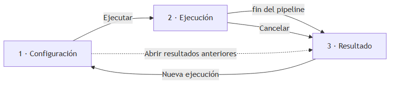

# Capítulo 5. Requisitos del Sistema

Este capítulo proporciona una representación técnica del producto requerido que indica lo que el sistema debe realizar para cumplir los requisitos de usuario del capítulo 4. Su contenido se alinea con el resultado del proceso de *Requirements Analysis Process* descrito en ISO/IEC/IEEE 15288 [3] y se especifica de acuerdo con la norma ISO/IEC/IEEE 29148:2018 [1], aplicando la **ficha esencial completa** a cada requisito atómico, con los atributos exigidos por 29148 §5.2.4 ("Characteristics of individual requirements") y §5.2.5 ("Characteristics of a set of requirements"): identificador único, descripción no ambigua y verificable, fuente trazable al RU del que deriva, prioridad y necesidad declaradas, mecanismo de verificación y dependencias con otros requisitos.

## 5.1 Requisitos funcionales

### 5.1.1 Funciones del sistema

Los requisitos funcionales se han agrupado en siete áreas: gestión de la entrada, *pipeline* de transformación, agente de descubrimiento, herramientas operativas del agente, gestión del proveedor de LLM, interfaces de usuario y gestión de errores y diagnóstico. Cada RF de primer nivel se descompone en sub-requisitos atómicos que detallan la capacidad correspondiente, especificados con la ficha completa.

#### RF-1. Gestión de la entrada (traza: RU-1)

El sistema debe aceptar tres modos de entrada y unificarlos internamente en una representación común antes de invocar al LLM.

##### RF-1.1 Lectura de archivo único

El sistema debe aceptar como entrada la ruta a un único archivo de texto y leer su contenido íntegro como evidencia del modelo documental, anteponiendo a su contenido una marca que identifique su ruta original.

| Atributo | Valor |
|---|---|
| Fuente | RU-1.1. |
| Prioridad | Alta. |
| Necesidad | Must. |
| Verificación | Ejecución de `python -m normalizer data/spruce/keys.js`; el artefacto `01_input.txt` reproduce el contenido del archivo con la marca de origen. |
| Dependencias | RF-2.1. |

##### RF-1.2 Lectura de directorio curado

El sistema debe aceptar como entrada la ruta a un directorio, leer los archivos contenidos en su primer nivel (no recursivo) y concatenar en un único documento de evidencia el contenido de aquellos que puedan decodificarse como UTF-8, anteponiendo a cada uno una marca que identifique su ruta original. Los archivos que no superan esa decodificación —imágenes, binarios compilados, etc.— se omiten del documento y sus nombres se anotan al final de éste, de modo que el usuario pueda comprobar qué se ha excluido.

| Atributo | Valor |
|---|---|
| Fuente | RU-1.2. |
| Prioridad | Alta. |
| Necesidad | Must. |
| Verificación | Ejecución de `python -m normalizer data/spruce-difuso/`; el artefacto `01_input.txt` contiene los ocho archivos concatenados con sus marcas de origen. Inclusión adicional de un fichero binario en el directorio; comprobación de que se omite y de que su nombre aparece anotado al final del artefacto. |
| Dependencias | RF-1.4, RF-2.1. |

##### RF-1.3 Lectura desde repositorio remoto

El sistema debe aceptar como entrada la URL de un repositorio Git público, clonarlo en un directorio de caché local y delegar en el subsistema de agentes (RF-3) la selección de los archivos relevantes.

| Atributo | Valor |
|---|---|
| Fuente | RU-1.3. |
| Prioridad | Alta. |
| Necesidad | Must. |
| Verificación | Ejecución sobre la URL pública del repositorio Spruce; el directorio `.cache/repos/<hash>/` contiene el repositorio clonado y `00_discovery/evidence/` la selección del agente. |
| Dependencias | RF-3, RF-4.1. |

##### RF-1.4 Validación de la entrada

El sistema debe verificar que la entrada existe y es accesible antes de invocar al *pipeline*, y debe informar al usuario con un mensaje claro en caso contrario, sin lanzar excepciones no controladas.

| Atributo | Valor |
|---|---|
| Fuente | RU-1, RNF-3.2 (usabilidad de mensajes de error). |
| Prioridad | Media. |
| Necesidad | Must. |
| Verificación | Invocación de la CLI con una ruta inexistente; comprobación de un código de salida distinto de cero y un mensaje legible por la salida de error estándar. |
| Dependencias | — |

##### RF-1.5 Filtrado del contenido no procesable del repositorio

En el modo de entrada por repositorio (RF-1.3), tanto el árbol del repositorio que el agente recibe al inicio como sus herramientas de exploración (RF-4.1) deben excluir el contenido que no puede aportar evidencia textual del modelo documental: directorios de dependencias y de artefactos generados (`node_modules`, `dist`, `.git`, etc.) y archivos binarios o minificados identificados por su extensión (imágenes, fuentes, multimedia, ejecutables, `*.min.js`, etc.). Adicionalmente, los archivos cuyo tamaño supere un umbral fijo (200 KB) se omiten del árbol y no pueden leerse, buscarse ni seleccionarse como evidencia. La exclusión no es silenciosa para el agente: si solicita leer un archivo excluido, la herramienta le responde con un error estructurado que indica el motivo.

| Atributo | Valor |
|---|---|
| Fuente | RU-1.3, RU-5.1, RNF-1.2 (consumo del contexto del LLM). |
| Prioridad | Media. |
| Necesidad | Must. |
| Verificación | Inspección de las listas de exclusión y del umbral de tamaño en `discovery/filesystem.py`; invocación sintética de `read_file` sobre un archivo de imagen del repositorio clonado, comprobando que devuelve `ERROR: archivo excluido por tipo` sin leerlo. |
| Dependencias | RF-1.3, RF-4.1, RNF-1.2. |

#### RF-2. *Pipeline* de transformación (traza: RU-2, RU-3, RU-7, RU-8)

El sistema debe estructurar la transformación en una secuencia de fases independientes, cada una con una entrada y una salida bien definidas, y persistir las salidas intermedias en disco.

##### RF-2.1 Fase de lectura

El sistema debe producir un artefacto de entrada agregada (`01_input.txt`) que contenga todos los fragmentos de evidencia que se pasarán al LLM, normalizados y marcados por su origen.

| Atributo | Valor |
|---|---|
| Fuente | RU-7.1. |
| Prioridad | Alta. |
| Necesidad | Must. |
| Verificación | Ejecución end-to-end; presencia del artefacto `01_input.txt` en el directorio de salida. |
| Dependencias | RF-1. |

##### RF-2.2 Fase de análisis del modelo documental

El sistema debe invocar al LLM con la entrada agregada y un *prompt* de análisis, y producir un artefacto en formato Markdown (`02_analysis.md`) que describa las entidades, atributos y relaciones detectadas, así como una traza de las evidencias en que se apoya cada decisión.

| Atributo | Valor |
|---|---|
| Fuente | RU-2. |
| Prioridad | Alta. |
| Necesidad | Must. |
| Verificación | Ejecución end-to-end sobre `data/spruce/`; el artefacto `02_analysis.md` recoge las cuatro entidades de referencia con citas explícitas de evidencia. |
| Dependencias | RF-2.1, RF-2.7. |

##### RF-2.3 Fase de diseño relacional

El sistema debe invocar al LLM con el análisis previo y un *prompt* de diseño que solicite la propuesta de un modelo relacional normalizado, y producir un artefacto en formato Markdown (`03_design.md`) que recoja dicho diseño. El *prompt* debe incluir la regla de reconciliación de atributos redundantes para evitar duplicidades de claves foráneas en el resultado.

| Atributo | Valor |
|---|---|
| Fuente | RU-3.1, RU-3.2. |
| Prioridad | Alta. |
| Necesidad | Must. |
| Verificación | Ejecución sobre `data/spruce-difuso/`; el artefacto `03_design.md` no contiene dos columnas en la misma tabla que referencien al mismo registro de otra tabla. |
| Dependencias | RF-2.2. |

##### RF-2.4 Fase de generación de DDL Oracle

El sistema debe invocar al LLM con el diseño relacional previo y un *prompt* de generación, y producir un artefacto (`04_ddl.sql`) con sentencias DDL compatibles con Oracle (`CREATE TABLE`, restricciones de clave primaria y foránea, tipos de datos Oracle).

| Atributo | Valor |
|---|---|
| Fuente | RU-3.3. |
| Prioridad | Alta. |
| Necesidad | Must. |
| Verificación | Inspección del artefacto `04_ddl.sql`: parseo correcto con un analizador SQL; presencia de `CREATE TABLE`, `PRIMARY KEY` y `FOREIGN KEY` en las cantidades esperadas. |
| Dependencias | RF-2.3. |

##### RF-2.5 Persistencia de artefactos intermedios

El sistema debe escribir en disco los cuatro artefactos generados por las fases anteriores (RF-2.1 a RF-2.4: `01_input.txt`, `02_analysis.md`, `03_design.md` y `04_ddl.sql`) en un directorio de salida configurable, de modo que el usuario pueda inspeccionarlos y compararlos posteriormente.

| Atributo | Valor |
|---|---|
| Fuente | RU-7.1. |
| Prioridad | Alta. |
| Necesidad | Must. |
| Verificación | Ejecución end-to-end; los cuatro artefactos están presentes en el directorio `--out-dir`. |
| Dependencias | RF-2.1, RF-2.2, RF-2.3, RF-2.4. |

##### RF-2.6 Aislamiento entre ejecuciones

El sistema debe permitir especificar un directorio de salida distinto en cada invocación, y por defecto no debe asumir que un mismo directorio se reutiliza entre ejecuciones distintas.

| Atributo | Valor |
|---|---|
| Fuente | RU-7.2. |
| Prioridad | Media. |
| Necesidad | Must. |
| Verificación | Dos ejecuciones consecutivas sobre datasets distintos con `--out-dir` distintos no comparten ni colisionan artefactos. |
| Dependencias | — |

##### RF-2.7 Externalización de *prompts*

Los *prompts* utilizados en cada fase del *pipeline* deben residir en archivos independientes (formato Markdown), no en cadenas literales dentro del código fuente, para facilitar su edición, versionado y reutilización entre proveedores.

| Atributo | Valor |
|---|---|
| Fuente | Decisión arquitectónica del capítulo 6 (§6.1.4). |
| Prioridad | Media. |
| Necesidad | Must. |
| Verificación | Inspección de `normalizer/prompts/`: existencia de los archivos `analyze.md`, `design.md`, `ddl.md` y `discovery_system.md`, cargados por el código sin contenido *prompt* embebido. |
| Dependencias | — |

#### RF-3. Agente de descubrimiento sobre repositorio (traza: RU-1.3, RU-5)

Cuando la entrada sea la URL de un repositorio, el sistema debe utilizar un agente para reconstruir el conjunto de archivos relevantes antes de invocar el *pipeline*.

##### RF-3.1 Exploración de la estructura del repositorio

El agente debe ser capaz de listar archivos y directorios del repositorio clonado, así como de abrir y leer aquellos que considere candidatos a contener evidencia del modelo documental.

| Atributo | Valor |
|---|---|
| Fuente | RU-5.1. |
| Prioridad | Alta. |
| Necesidad | Must. |
| Verificación | Inspección de la traza `00_discovery/discovery.md`: presencia de invocaciones a las herramientas `list_dir` y `read_file`. |
| Dependencias | RF-4. |

##### RF-3.2 Selección de archivos relevantes

El agente debe seleccionar el subconjunto de archivos cuya evidencia sea suficiente para reconstruir el modelo documental, priorizando *schemas* explícitos cuando existan y, en su defecto, archivos donde se realicen operaciones de lectura / escritura contra la base de datos.

| Atributo | Valor |
|---|---|
| Fuente | RU-5.1. |
| Prioridad | Alta. |
| Necesidad | Must. |
| Verificación | Ejecución sobre la URL pública de Spruce; el agente selecciona los cuatro *schemas* declarativos. |
| Dependencias | RF-4. |

##### RF-3.3 Generación de evidencia agregada

El agente debe entregar al *pipeline* (RF-2) una entrada agregada equivalente a la que produciría la lectura de un directorio curado por un humano (RF-1.2).

| Atributo | Valor |
|---|---|
| Fuente | RU-1.3, RU-5.1. |
| Prioridad | Alta. |
| Necesidad | Must. |
| Verificación | Tras el agente, el directorio `00_discovery/evidence/` contiene los archivos seleccionados con sus rutas aplanadas; el *pipeline* arranca sobre ese directorio. |
| Dependencias | RF-1.2. |

##### RF-3.4 Traza de las decisiones del agente

El agente debe registrar, en un artefacto adicional dentro del directorio de salida (`00_discovery/discovery.md`), qué archivos ha examinado, cuáles ha seleccionado y por qué.

| Atributo | Valor |
|---|---|
| Fuente | RU-5.2. |
| Prioridad | Alta. |
| Necesidad | Must. |
| Verificación | Inspección del artefacto: tabla `Iter | Tool calls` con las invocaciones y lista de archivos seleccionados con sus justificaciones. |
| Dependencias | — |

##### RF-3.5 Límites operativos del agente

La ejecución del agente debe estar acotada por límites **configurables por el usuario desde la CLI y la GUI**: el número de pasos (`max_iters`) y de archivos seleccionados (`max_files`) —al excederse, la operación aborta con un mensaje claro y registra la causa en la traza— y el número máximo de entradas del árbol del repositorio que se le entrega en el primer mensaje (`max_tree_entries`, véase RNF-1.2).

| Atributo | Valor |
|---|---|
| Fuente | RNF-1.3 (coste). |
| Prioridad | Media. |
| Necesidad | Must. |
| Verificación | Invocación con `--max-iters 2` sobre un repositorio mediano; comprobación de que la ejecución termina con la marca de "presupuesto agotado" en la traza. Invocación con `--max-tree-entries` reducido; comprobación de que el árbol de `00_discovery/tree.txt` se trunca al valor indicado. |
| Dependencias | RNF-1.3. |

#### RF-4. Herramientas operativas del agente (traza: RU-5)

El agente definido en RF-3 debe disponer de un conjunto acotado de herramientas para interactuar con el repositorio clonado y el directorio de salida. Estas herramientas se exponen al LLM mediante el mecanismo nativo de *function calling* del proveedor.

##### RF-4.1 Herramientas de exploración del repositorio

El sistema debe poner a disposición del agente herramientas para: listar el contenido de un directorio del repositorio clonado; leer el contenido de un archivo concreto; realizar búsquedas textuales por patrón sobre el conjunto de archivos; marcar un archivo como evidencia relevante; y declarar el cierre de la sesión de descubrimiento.

| Atributo | Valor |
|---|---|
| Fuente | RU-5.1, RU-5.2. |
| Prioridad | Alta. |
| Necesidad | Must. |
| Verificación | Inspección de la traza `00_discovery/discovery.md`: aparición de las cinco herramientas (`list_dir`, `read_file`, `grep`, `select_evidence`, `done`) al menos en uno de los datasets de validación. |
| Dependencias | RF-4.2, RF-4.3, RF-4.4. |

##### RF-4.2 Confinamiento de las herramientas

Las herramientas de acceso al sistema de archivos deben operar exclusivamente dentro del directorio temporal donde se ha clonado el repositorio analizado y dentro del directorio de salida de la ejecución, rechazando cualquier ruta que escape de estos ámbitos.

| Atributo | Valor |
|---|---|
| Fuente | RNF-4.2 (control de efectos de los agentes). |
| Prioridad | Alta. |
| Necesidad | Must. |
| Verificación | Inyección de una invocación sintética con una ruta tipo `../../etc/passwd`; comprobación de que la herramienta devuelve un error estructurado y no accede al archivo. |
| Dependencias | RNF-4.2. |

##### RF-4.3 Validación de los argumentos

Cada herramienta debe validar los argumentos recibidos del LLM antes de ejecutarse, devolviendo al agente un mensaje de error estructurado en caso de argumentos inválidos en lugar de elevar excepciones.

| Atributo | Valor |
|---|---|
| Fuente | RNF-2.2 (fiabilidad). |
| Prioridad | Media. |
| Necesidad | Must. |
| Verificación | Inyección de una invocación con argumentos del tipo incorrecto; la herramienta devuelve `ERROR: …` y la ejecución continúa. |
| Dependencias | — |

##### RF-4.4 Definición independiente del proveedor

La descripción de cada herramienta (nombre, parámetros, tipos, descripción para el LLM) debe definirse una sola vez en un formato común (estructura `ToolSpec`), y la abstracción de proveedor (RF-5) debe encargarse de traducirla al formato concreto que cada proveedor de LLM espera para *function calling*.

| Atributo | Valor |
|---|---|
| Fuente | Decisión arquitectónica (§6.1.4). |
| Prioridad | Alta. |
| Necesidad | Must. |
| Verificación | Inspección del código: ausencia de definiciones de herramientas en `providers/`; presencia de `ALL_TOOLS` en `discovery/tools.py` reutilizable por cualquier proveedor. |
| Dependencias | RF-5.1. |

#### RF-5. Gestión del proveedor de LLM (traza: RU-4)

El sistema debe permitir elegir el proveedor y el modelo de LLM en cada ejecución, sin acoplar el resto del *pipeline* a un proveedor concreto.

##### RF-5.1 Abstracción de proveedor

El sistema debe definir una interfaz uniforme de proveedor de LLM con dos operaciones obligatorias del núcleo: una para generación de texto a partir de un *prompt* (`generate`) y otra para diálogo con herramientas (`chat`). El *pipeline* y el agente deben usar exclusivamente esta interfaz, sin importar SDKs específicos de proveedor. La interfaz expone adicionalmente una operación auxiliar (`list_models`) que la GUI consume para mantener el selector de modelos sincronizado con el catálogo actual del proveedor sin requerir intervención en el código.

| Atributo | Valor |
|---|---|
| Fuente | RU-4.1, RU-4.2. |
| Prioridad | Alta. |
| Necesidad | Must. |
| Verificación | Inspección de `normalizer/pipeline/pipeline.py` y `normalizer/discovery/agent.py`: ausencia de *imports* de los SDKs `google.genai` o `groq`; uso únicamente de la interfaz `LLMProvider`. |
| Dependencias | — |

##### RF-5.2 Registro extensible de proveedores

El sistema debe disponer de un registro de proveedores soportados, ampliable mediante el alta de una nueva clase de proveedor sin necesidad de modificar el código del *pipeline*, del agente o de la CLI.

| Atributo | Valor |
|---|---|
| Fuente | RU-4.1. |
| Prioridad | Alta. |
| Necesidad | Must. |
| Verificación | Inspección de `normalizer/providers/__init__.py`: presencia de un diccionario `_REGISTRY` y de una función `build_provider`; comprobación de que añadir un proveedor nuevo requiere solo modificar `providers/`. |
| Dependencias | RF-5.1. |

##### RF-5.3 Selección de proveedor y modelo

El usuario debe poder indicar, en el momento de la invocación, qué proveedor y qué modelo concreto se utilizarán para cada uno de los dos roles (*pipeline* y agente). En ausencia de elección, el sistema debe usar valores por defecto definidos para cada proveedor.

| Atributo | Valor |
|---|---|
| Fuente | RU-4.1, RU-4.2. |
| Prioridad | Alta. |
| Necesidad | Must. |
| Verificación | Invocación con `--provider`, `--model` y `--agent-model` arbitrarios; comprobación de que la traza refleja los valores empleados. |
| Dependencias | RF-5.1, RF-5.2. |

##### RF-5.4 Soporte mínimo multiproveedor

La interfaz de proveedor definida en RF-5.1 debe estar implementada para al menos dos servicios de LLM distintos (en este trabajo, Google y Groq), de modo que el usuario pueda ejecutar la transformación con uno u otro sin cambios en el código. Disponer de dos proveedores intercambiables es lo que permite comprobar que el resto del sistema no depende de las particularidades de un servicio concreto.

| Atributo | Valor |
|---|---|
| Fuente | RU-4.1. |
| Prioridad | Alta. |
| Necesidad | Must. |
| Verificación | Inspección de `normalizer/providers/`: presencia de `google.py` y `groq.py`, ambos registrados en `_REGISTRY` y ambos validados sobre al menos un dataset. |
| Dependencias | RF-5.1, RF-5.2. |

##### RF-5.5 Configuración de credenciales

Las credenciales (API keys) de cada proveedor deben leerse de variables de entorno o de un archivo de configuración local no versionado, nunca quedar embebidas (*hardcoded*) en el código fuente.

| Atributo | Valor |
|---|---|
| Fuente | RU-4.3, RNF-4.1. |
| Prioridad | Alta. |
| Necesidad | Must. |
| Verificación | Auditoría del repositorio: `grep -r "AIza\|gsk_" .` no devuelve resultados; `.env.example` documenta los nombres de variable; `.env` está en `.gitignore`. |
| Dependencias | RNF-4.1. |

#### RF-6. Interfaces de usuario (traza: RU-6)

El sistema debe ofrecer dos modos de uso adaptados a perfiles distintos.

##### RF-6.1 Interfaz de línea de comandos (CLI)

El sistema debe ofrecer un punto de entrada CLI que acepte, como mínimo, los siguientes parámetros: ruta o URL de entrada, directorio de salida, proveedor de LLM, modelo del *pipeline*, modelo del agente. La CLI debe mostrar al usuario el avance del *pipeline* (qué fase está ejecutándose y cuándo termina cada una) mediante eventos por la salida de error estándar con sello de tiempo relativo.

| Atributo | Valor |
|---|---|
| Fuente | RU-6.1. |
| Prioridad | Alta. |
| Necesidad | Must. |
| Verificación | Invocación `python -m normalizer --help` muestra las opciones; ejecución de extremo a extremo emite mensajes `[mm:ss]` por cada fase. |
| Dependencias | — |

##### RF-6.2 Interfaz gráfica de usuario (GUI)

El sistema debe ofrecer una GUI que permita, sin uso de la línea de comandos: seleccionar la fuente de entrada (archivo, directorio o URL); configurar el proveedor, el modelo del *pipeline* y el modelo del agente; lanzar la ejecución y seguir su progreso en tiempo real; visualizar los artefactos intermedios; exportar los artefactos como un único fichero `.zip` o abrir el directorio de salida en el explorador del sistema; y recuperar corridas anteriores sin re-ejecutar el *pipeline* abriendo un directorio `out-*/` previo.

| Atributo | Valor |
|---|---|
| Fuente | RU-6.2. |
| Prioridad | Alta. |
| Necesidad | Must. |
| Verificación | Reproducción manual desde la GUI de un caso completo (`data/spruce/`) por un usuario sin conocimiento previo del CLI; comprobación de la presencia de los cuatro artefactos. |
| Dependencias | RF-6.3, RF-6.1. |

##### RF-6.3 Paridad funcional CLI / GUI

Toda funcionalidad expuesta por la GUI debe poder ejecutarse también desde la CLI, para no quedar atada al modo gráfico de uso. En la práctica, la GUI invoca el mismo punto de entrada del núcleo (`run_pipeline` y `discover_from_url`) que utiliza el CLI, sin duplicar lógica.

| Atributo | Valor |
|---|---|
| Fuente | RU-6 (interfaz adecuada al perfil). |
| Prioridad | Alta. |
| Necesidad | Must. |
| Verificación | Inspección del código: la GUI no implementa lógica de pipeline ni de agente. Comparación de los DDL resultantes para un mismo dataset desde CLI y GUI. |
| Dependencias | RF-6.1, RF-6.2. |

#### RF-7. Gestión de errores y diagnóstico

El sistema debe informar de forma comprensible de cualquier condición de error y permitir el diagnóstico de fallos en el *pipeline*.

##### RF-7.1 Errores del proveedor

Los errores devueltos por el proveedor de LLM (autenticación, cuota agotada, modelo no disponible, salida malformada) deben capturarse y presentarse al usuario con un mensaje que indique la fase del *pipeline* en que se produjeron.

| Atributo | Valor |
|---|---|
| Fuente | RNF-3.2 (usabilidad de mensajes de error). |
| Prioridad | Media. |
| Necesidad | Must. |
| Verificación | Invocación con una API key inválida; el mensaje de error identifica la fase ("análisis", "diseño", "DDL", "agente") y la causa. |
| Dependencias | RF-5.5. |

##### RF-7.2 Observabilidad por fases

El sistema debe emitir, por la salida de error estándar, eventos breves con sello de tiempo relativo al arranque del proceso (`[mm:ss]`) en los puntos clave de la ejecución: inicio del CLI, inicio y fin de cada fase del *pipeline*, clonado del repositorio, cada iteración del agente con un resumen compacto de las invocaciones, y los reintentos del proveedor. En la GUI, el reloj relativo se reinicia al inicio de cada corrida (las corridas suceden en el mismo proceso pero el usuario espera ver `[00:00]` en la primera línea de cada una), mientras que en la CLI coincide con el arranque del proceso.

| Atributo | Valor |
|---|---|
| Fuente | Necesidad práctica observada durante el desarrollo (depuración de bucles del agente). |
| Prioridad | Media. |
| Necesidad | Must. |
| Verificación | Ejecución sobre un dataset; aparición de los eventos `[mm:ss]` esperados en `2> log.txt`. |
| Dependencias | — |

##### RF-7.3 Reanudación parcial

Cuando la ejecución falle en una fase distinta de la primera, el sistema debe conservar los artefactos intermedios producidos hasta ese punto, de modo que un usuario avanzado pueda retomar la ejecución desde el último artefacto válido.

| Atributo | Valor |
|---|---|
| Fuente | RNF-2.2 (fiabilidad). |
| Prioridad | Baja. |
| Necesidad | Should. |
| Verificación | Inducción artificial de un fallo en la fase de DDL (clave inválida); comprobación de que `02_analysis.md` y `03_design.md` siguen presentes en el directorio de salida. |
| Dependencias | RF-2.5. |

### 5.1.2 Modelo de datos del dominio

El sistema razona simultáneamente sobre dos modelos de datos distintos: por una parte, el **modelo conceptual del dominio** —entidades, atributos, claves y relaciones del modelo entidad-relación que la herramienta produce—; por otra, las **estructuras internas neutras** que materializan la interacción con cualquier proveedor de LLM (`Message`, `ToolSpec`, `ToolCall`, `ChatResponse`) y el estado del agente (`DiscoveryState`). El primero es el objeto de salida de la herramienta y se describe en detalle en §6.2.7; el segundo es el lenguaje común con el que el resto del sistema describe la interacción con el LLM y se describe en detalle en §6.2.2 mediante un diagrama de clases. Esta separación es deliberada: el dominio del problema (modelado relacional) es independiente de cómo se realiza la interacción con el LLM.

### 5.1.3 Interfaz de usuario

#### Interfaz de línea de comandos

La CLI sigue las convenciones POSIX: un argumento posicional para la entrada, opciones con doble guion para la configuración y mensaje de ayuda accesible con `--help`. La invocación típica tiene la forma:

```
python -m normalizer <entrada> [--provider NOMBRE] [--model MODELO] [--agent-model MODELO] [--out-dir DIR]
```

El argumento `<entrada>` puede ser una ruta (archivo o directorio) o una URL de repositorio; el sistema lo detecta automáticamente mediante el prefijo (`http://`, `https://`, `git@`). La CLI emite, durante la ejecución, mensajes breves con sello de tiempo relativo al arranque (`[mm:ss]`) indicando el inicio y fin de cada fase del *pipeline* y de cada iteración del agente, así como la ruta del directorio de salida resultante.

#### Interfaz gráfica de usuario

La GUI se organiza como una secuencia guiada de tres pantallas —configuración, ejecución y resultado— en lugar de un conjunto de ventanas independientes: el usuario avanza por ellas en el orden natural de una ejecución. La figura 5.1 resume la navegación completa, incluidos los dos atajos existentes (cancelar una ejecución en curso y abrir los resultados de una corrida anterior).



**Pantalla 1 — Configuración.** Un único formulario reúne todos los parámetros de la ejecución:

- **Entrada**: archivo, directorio o URL de repositorio, con validación inmediata.
- **Proveedor y modelos**: combo de proveedor y combos de modelo del *pipeline* y del agente, poblados dinámicamente desde el catálogo del proveedor seleccionado (`LLMProvider.list_models()`), con los valores por defecto preseleccionados.
- **Credenciales**: campo enmascarado para la *API key*, visible solo si la variable de entorno correspondiente no está ya definida; las claves introducidas se persisten en `.env` (excluido del repositorio por `.gitignore`).
- **Directorio de salida** configurable.
- **Abrir resultados anteriores**: enlace que salta directamente a la pantalla de resultado sobre el directorio de una corrida previa, sin re-ejecutar el *pipeline*.

```
┌─ Configuración ───────────────────────────────────┐
│ Entrada          [ ruta o URL            ][ … ]   │
│ Proveedor        [ google ▾ ]                     │
│ Modelo pipeline  [ gemma-4-31b-it            ▾ ]  │
│ Modelo agente    [ gemini-3.1-flash-lite     ▾ ]  │
│ API key          [ ●●●●●●●●●●●● ]                 │
│ Dir. de salida   [ out/                  ][ … ]   │
│                                                   │
│ Abrir resultados anteriores…        [ Ejecutar ]  │
└───────────────────────────────────────────────────┘
```

*Prototipo de la pantalla de configuración.*

**Pantalla 2 — Ejecución y progreso.** Muestra el avance de la corrida en tres niveles de detalle:

- **Indicador de fases** con la fase activa resaltada: Descubrimiento (solo en el modo URL), Análisis, Diseño y DDL.
- **Tabla viva del agente** (modo URL): una fila por iteración con las herramientas invocadas en cada una.
- **Panel de *log*** con sello de tiempo `[mm:ss]` — el mismo flujo de observabilidad que emite la CLI.
- **Botón Cancelar**: propaga la cancelación cooperativa al núcleo (RF-7.3) y transita inmediatamente a la pantalla de resultado; la llamada HTTP en curso, no abortable, termina en segundo plano sin bloquear la interfaz.

```
┌─ Ejecución ───────────────────────────────────────┐
│  ● Descubrimiento   ● Análisis   ○ Diseño   ○ DDL │
│  █████████████████░░░░░░░░░░░░░░░░░               │
│ ┌─ Agente (modo URL) ───────────────────────────┐ │
│ │ iter │ herramientas invocadas                 │ │
│ │  3   │ read_file ×2, grep                     │ │
│ └───────────────────────────────────────────────┘ │
│ ┌─ Log ─────────────────────────────────────────┐ │
│ │ [02:13] fase de análisis: invocando al LLM…   │ │
│ └───────────────────────────────────────────────┘ │
│                                      [ Cancelar ] │
└───────────────────────────────────────────────────┘
```

*Prototipo de la pantalla de ejecución.*

**Pantalla 3 — Resultado.** Una pestaña por artefacto, con el diagrama ER como vista por defecto:

- **Diagrama ER** auto-generado a partir del DDL final (parser por *regex* + Graphviz).
- **Diseño relacional** (`03_design.md`) en Markdown renderizado.
- **DDL** (`04_ddl.sql`) con resaltado de sintaxis SQL.
- **Análisis** (`02_analysis.md`) en Markdown renderizado.
- **Descubrimiento** (modo URL): la traza del agente (`00_discovery/discovery.md`).
- **Barra de acciones**: abrir el directorio de salida en el explorador del sistema, exportar todos los artefactos en un `.zip` o lanzar una nueva ejecución sin cerrar la aplicación.

```
┌─ Resultado ───────────────────────────────────────┐
│ [ ER ]( Diseño )( DDL )( Análisis )( Descubr. )   │
│ ┌───────────────────────────────────────────────┐ │
│ │                                               │ │
│ │        (artefacto de la pestaña activa)       │ │
│ │                                               │ │
│ └───────────────────────────────────────────────┘ │
│ [ Abrir carpeta ] [ Exportar ZIP ] [ Nueva ejec. ]│
└───────────────────────────────────────────────────┘
```

*Prototipo de la pantalla de resultado.*

La paridad funcional con la CLI se garantiza porque la GUI invoca directamente los mismos puntos de entrada del núcleo (`run_pipeline`, `discover_from_url`) que utiliza el módulo de línea de comandos.

## 5.2 Requisitos no funcionales

Los requisitos no funcionales se organizan en cinco categorías —rendimiento, fiabilidad, usabilidad, seguridad y restricciones de implementación— alineadas con el modelo de calidad del producto *software* de la norma ISO/IEC 25010. Cada requisito se ha formulado siguiendo las características de un requisito bien formado que define la norma ISO/IEC/IEEE 29148 (necesario, factible, singular, no ambiguo y, sobre todo, verificable): su enunciado describe una propiedad real del sistema entregado, y su verificación se apoya en medios efectivamente disponibles —inspección del código fuente, de los artefactos producidos o de las trazas de ejecución— y no en pruebas no implementadas. La categoría de seguridad se inspira, además, en el Nivel 1 de OWASP ASVS y en las buenas prácticas recogidas en la plantilla del TFG.

### 5.2.1 RNF-1. Rendimiento

#### RNF-1.1 Tiempo de respuesta del *pipeline*

Para una entrada de hasta unos 30 KB de texto —el tamaño de la evidencia agregada del mayor *dataset* de referencia, `data/spruce-difuso/` (≈ 29 KB)— y empleando los modelos por defecto del *pipeline* (`gemma-4-31b-it` de Google o `llama-3.3-70b-versatile` de Groq, ambos de tamaño medio, del orden de 31 000 a 70 000 millones de parámetros), el *pipeline* completo debe terminar en menos de 5 minutos en condiciones normales de red. El sistema no se considera un sistema de tiempo real: este límite es orientativo y depende de la latencia del proveedor.

| Atributo | Valor |
|---|---|
| Fuente | Expectativa de uso interactivo en GUI; experiencia del autor con tiempos aceptables en entornos de defensa. |
| Prioridad | Media. |
| Necesidad | Should. |
| Verificación | Medición puntual de la duración del *pipeline* sobre `data/spruce/` y `data/spruce-difuso/` con cada uno de los dos proveedores, a partir de la traza `[mm:ss]` de `_log.py` conservada en los directorios `out-*` (§11.3.4). Peor caso medido: del orden de 4 min sobre el difuso con `gemma-4-31b-it` (Google); el mismo input se resolvió en unos 18 s con `llama-3.3-70b-versatile` (Groq). Ambos por debajo del umbral. |
| Dependencias | — |

#### RNF-1.2 Acotación del contexto del agente

El contexto que el agente de descubrimiento envía al LLM debe estar acotado, para no depender de límites de *tokens* abundantes en el proveedor. En concreto, el árbol del repositorio que el agente recibe en su primer mensaje se limita a un máximo de entradas **configurable por el usuario** —opción `--max-tree-entries` en la CLI y campo equivalente en la GUI—, **por defecto 2 000** (~30 K *tokens*), mediante un recorrido por anchura (BFS), de modo que todos los directorios de primer nivel queden cubiertos aunque el corte se agote. Poder reducir este límite permite adaptar el tamaño del primer mensaje a las cuotas de *tokens* del proveedor (frontera Groq, RNF-1.3). Además, los archivos que no se pueden decodificar como texto se descartan al construir la evidencia del *pipeline*.

| Atributo | Valor |
|---|---|
| Fuente | Frontera observada con Groq sobre repositorios medianos durante la validación experimental (§11.3). |
| Prioridad | Alta. |
| Necesidad | Must. |
| Verificación | Inspección de `build_tree_summary` en `discovery/filesystem.py`: recorrido BFS con corte configurable (`MAX_TREE_ENTRIES`, por defecto 2 000). Reducir `--max-tree-entries` disminuye el número de líneas de `tree.txt`; las corridas sobre Habitica de §11.3 evidencian el efecto del corte sobre el tamaño del primer mensaje del agente. |
| Dependencias | RF-1.5. |

#### RNF-1.3 Coste de las ejecuciones con agentes

La ejecución del agente (RF-3) debe estar acotada por un número máximo de iteraciones (`max_iters`) y de archivos seleccionables (`max_files`), configurables por el usuario desde la CLI (`--max-iters`, `--max-files`) y la GUI, para evitar consumos imprevistos de cuota.

| Atributo | Valor |
|---|---|
| Fuente | RU-4 (independencia de proveedor implica no depender de cuotas abundantes). |
| Prioridad | Alta. |
| Necesidad | Must. |
| Verificación | Inspección de `discovery/agent.py`: presencia de las constantes `MAX_ITERS=30` y `MAX_FILES=30`, ambas configurables por el llamador. |
| Dependencias | RF-3.5. |

### 5.2.2 RNF-2. Fiabilidad

#### RNF-2.1 Reproducibilidad estructural de las ejecuciones

Dadas la misma entrada, el mismo proveedor, el mismo modelo y los mismos *prompts*, el sistema debe producir resultados estructuralmente equivalentes entre ejecuciones. Las pequeñas variaciones inherentes a la naturaleza estocástica de los LLMs son aceptables; las diferencias sustanciales en el modelo relacional resultante deben analizarse como un fallo del *prompt* o del modelo, no como ruido normal.

| Atributo | Valor |
|---|---|
| Fuente | Casuística observada durante el desarrollo: rango de cobertura inter-*runs* documentado en la traza experimental del proyecto. |
| Prioridad | Media. |
| Necesidad | Should. |
| Verificación | Conservación de los artefactos de las ejecuciones reportadas (directorios `out-*`, §11.3.4) e inspección de su equivalencia estructural. La varianza inherente a los LLMs se reporta de forma explícita —por ejemplo, el rango de 5 a 22 archivos seleccionados por el agente en tres corridas sobre Habitica (§11.3.3, §9.1.2)— en lugar de fijarse una banda numérica artificial. |
| Dependencias | — |

#### RNF-2.2 Robustez ante fallos transitorios del proveedor

Los fallos transitorios del proveedor (*timeouts*, *rate limits*, errores 5xx) deben gestionarse mediante reintentos con espera exponencial respetando, cuando lo proporcione el proveedor, el tiempo de espera sugerido en la cabecera de la respuesta. Tras agotar los reintentos, el sistema debe terminar con un código de error claro y conservar los artefactos intermedios producidos hasta ese punto.

| Atributo | Valor |
|---|---|
| Fuente | Casuística observada con Gemma (códigos 500 / 503 frecuentes) y con Groq (cuota agotada). |
| Prioridad | Alta. |
| Necesidad | Must. |
| Verificación | Inspección de `_call_with_retry` en `providers/google.py` (códigos `{429, 500, 502, 503, 504}`) y en `providers/groq.py` (`RateLimitError`). Los reintentos reales quedan registrados en las trazas `[mm:ss]` de las corridas de §11.3 (por ejemplo, dos respuestas 429 absorbidas en la ejecución de Habitica). La conservación de los artefactos parciales se sigue de que cada fase escribe su artefacto antes de continuar (`pipeline/pipeline.py`). |
| Dependencias | RF-7.3. |

### 5.2.3 RNF-3. Usabilidad

#### RNF-3.1 Documentación de uso

Tanto la CLI como la GUI deben venir acompañadas de documentación que permita ejecutar una transformación de extremo a extremo siguiendo un manual de inicio rápido, tanto al usuario que opera desde la línea de comandos (con conocimientos básicos de Python) como al que prefiere la interfaz gráfica.

| Atributo | Valor |
|---|---|
| Fuente | RU-6 (interfaz adecuada al perfil). |
| Prioridad | Media. |
| Necesidad | Must. |
| Verificación | Inspección del capítulo 8 ("Manuales") de esta memoria. |
| Dependencias | — |

#### RNF-3.2 Mensajes de error orientados al usuario

Los errores deben comunicarse al usuario sin que la herramienta termine volcando una traza sin contexto en la interfaz. La CLI valida la entrada antes de arrancar el *pipeline*; la GUI captura cualquier fallo de la ejecución, lo presenta en un mensaje que identifica la fase en la que ocurrió, y conserva tanto la traza completa en el log como los artefactos parciales ya escritos en disco.

| Atributo | Valor |
|---|---|
| Fuente | Buenas prácticas de UX. |
| Prioridad | Media. |
| Necesidad | Should. |
| Verificación | Inspección de la validación de entrada en `cli/cli.py` (`click.BadParameter`) y del manejo de errores de la GUI en `gui/controller.py`: captura de excepciones traducida a un `ErrorEvent` con la fase, traza completa a *stderr* / log y preservación de los artefactos parciales. |
| Dependencias | RF-7.1. |

#### RNF-3.3 Comprensibilidad de los artefactos intermedios

Los artefactos producidos por el *pipeline* deben ser legibles directamente por un humano (Markdown para análisis y diseño, SQL plano para el DDL), sin requerir herramientas adicionales para inspeccionarlos.

| Atributo | Valor |
|---|---|
| Fuente | RU-7.1. |
| Prioridad | Alta. |
| Necesidad | Must. |
| Verificación | Inspección de los artefactos producidos sobre `data/spruce/`: `02_analysis.md` y `03_design.md` se renderizan correctamente; `04_ddl.sql` se abre como texto plano. |
| Dependencias | RF-2.5. |

### 5.2.4 RNF-4. Seguridad

#### RNF-4.1 No *hardcoding* de credenciales

Ninguna API key, *token* o secreto debe aparecer en el código fuente ni en archivos versionados del repositorio. Las credenciales deben proporcionarse mediante variables de entorno o archivos `.env` locales no versionados.

| Atributo | Valor |
|---|---|
| Fuente | OWASP ASVS Nivel 1 §V2.10. |
| Prioridad | Alta. |
| Necesidad | Must. |
| Verificación | Auditoría con `git log -p | grep -i "api[_-]key"`; ausencia de coincidencias. Presencia de `.env` en `.gitignore`. |
| Dependencias | — |

#### RNF-4.2 Control de efectos del agente

El agente no debe poder ejecutar operaciones con efectos persistentes fuera del directorio de salida y del directorio temporal de clonado del repositorio sin autorización explícita del usuario. En particular, no debe poder modificar el repositorio analizado ni acceder a archivos fuera del ámbito declarado.

| Atributo | Valor |
|---|---|
| Fuente | Buenas prácticas de aislamiento de agentes LLM. |
| Prioridad | Alta. |
| Necesidad | Must. |
| Verificación | Inspección de `resolve_within` en `discovery/filesystem.py`: rechazo activo de rutas que escapen del repositorio o del directorio de salida. |
| Dependencias | RF-4.2. |

#### RNF-4.3 Privacidad de la entrada del usuario

El sistema debe informar al usuario de que el contenido de la entrada (archivos, fragmentos del repositorio) se envía a un proveedor de LLM externo, y por tanto no debe utilizarse con código fuente o esquemas confidenciales que el usuario no esté autorizado a compartir con dicho proveedor.

| Atributo | Valor |
|---|---|
| Fuente | RNF-4.1 (privacidad como complemento a no *hardcoding*). |
| Prioridad | Media. |
| Necesidad | Must. |
| Verificación | Inclusión de la advertencia correspondiente en el manual de usuario (capítulo 8). |
| Dependencias | — |

### 5.2.5 RNF-5. Restricciones de implementación

#### RNF-5.1 Lenguaje de implementación

La herramienta se implementa en Python 3.11 o superior, por razones de ecosistema: disponibilidad de los SDKs oficiales de los proveedores de LLM y de las librerías de soporte (`google-genai`, `groq`, `click` y `python-dotenv` en el núcleo; `customtkinter` y `pygments` en el extra opcional `[gui]`). El agente de descubrimiento se apoya en el *tool-use* nativo de cada SDK, sin depender de un *framework* de agentes externo.

| Atributo | Valor |
|---|---|
| Fuente | Disponibilidad de SDKs y experiencia del autor. |
| Prioridad | Alta. |
| Necesidad | Must. |
| Verificación | Inspección del `pyproject.toml`: `requires-python = ">=3.11"`. |
| Dependencias | — |

#### RNF-5.2 Compatibilidad de salida

El DDL generado debe ser compatible con Oracle Database. La versión mínima objetivo del DDL es Oracle 23ai, ya que el sistema emite columnas de tipo `BOOLEAN` de forma nativa. Para entornos Oracle <23 sería necesario un mapeo posterior a `NUMBER(1)` o `CHAR(1)`, que se documenta como ampliación en el capítulo 9.

| Atributo | Valor |
|---|---|
| Fuente | RU-3.3, y casuística del entorno *legacy* del autor. |
| Prioridad | Media. |
| Necesidad | Must. |
| Verificación | Inspección del DDL generado (`04_ddl.sql`) sobre los datasets de referencia: sentencias `CREATE TABLE` de Oracle con sus claves primarias y foráneas. El uso de columnas `BOOLEAN` se documenta como condicionante de la versión mínima (cf. Ampliación C del capítulo 9). |
| Dependencias | — |

