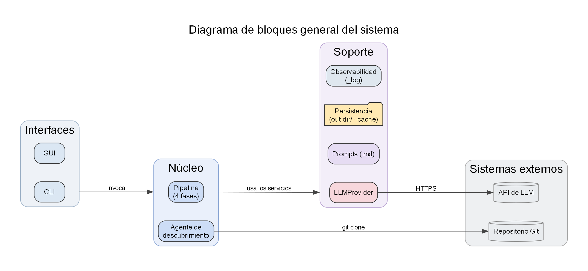
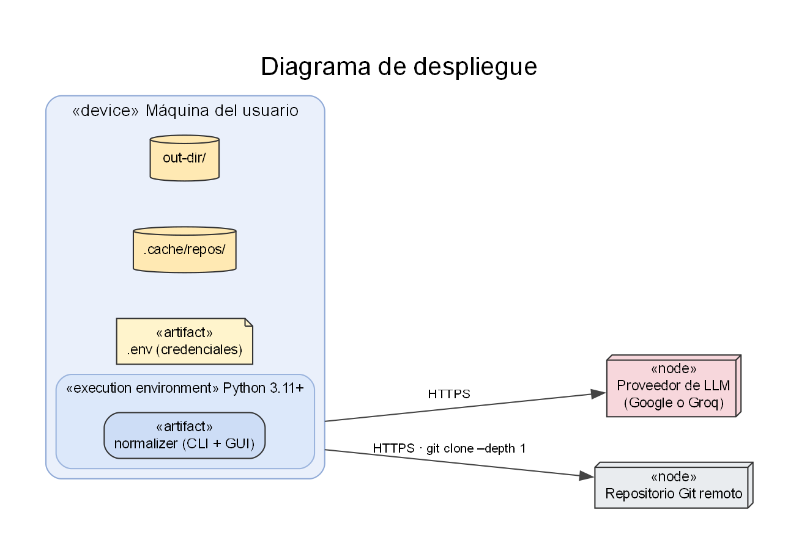
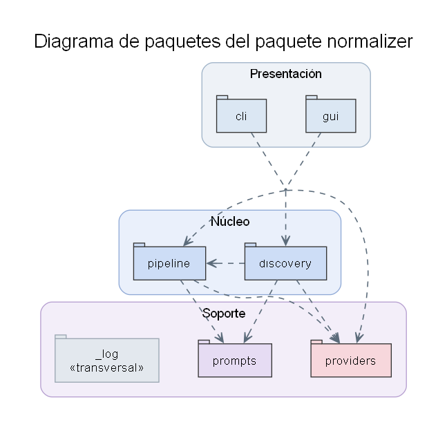
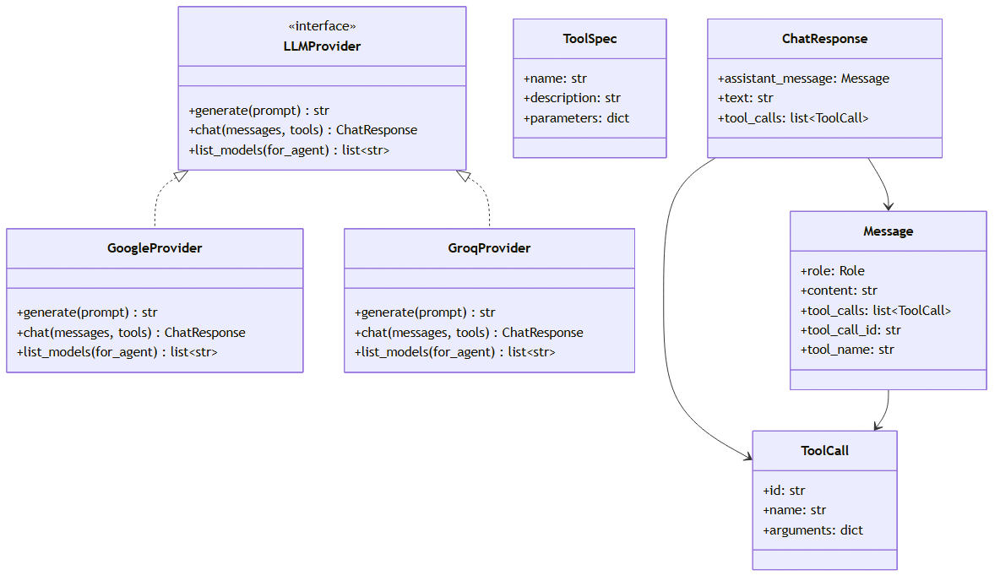
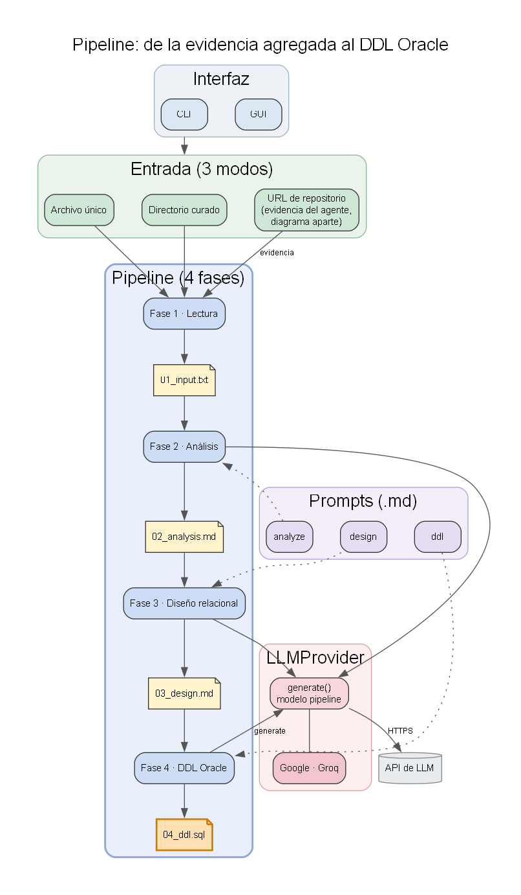
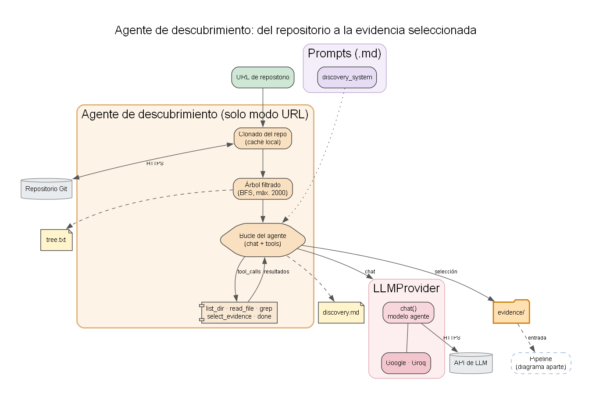
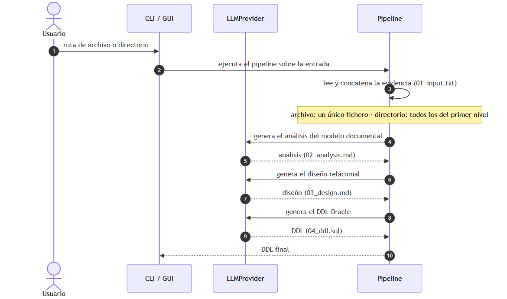
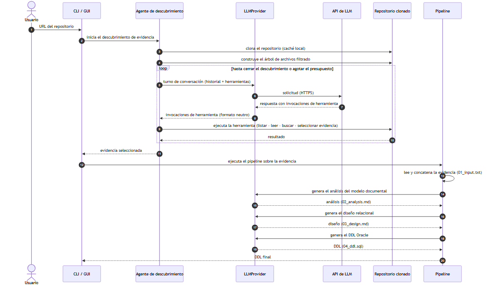
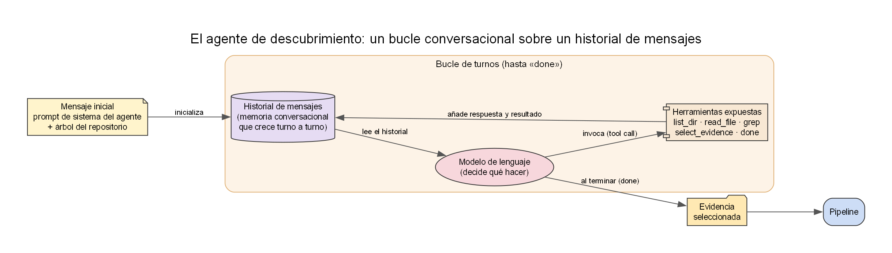

# Capítulo 6. Diseño

Este capítulo describe el diseño del sistema a partir de los requisitos enunciados en el capítulo 5. Se organiza en dos apartados: la **arquitectura general** (6.1) describe los componentes lógicos del sistema y su despliegue; el **diseño de detalle** (6.2) explica la estructura interna del código, el flujo de ejecución y los patrones de diseño empleados.

## 6.1 Diseño de la arquitectura

### 6.1.1 Visión general

El sistema es una **aplicación de escritorio mono-proceso y local**: cada ejecución es autocontenida, se ejecuta en la máquina del usuario y no expone ningún servicio remoto.

Su núcleo es el ***pipeline***, una **cadena de cuatro fases** —lectura, análisis del modelo documental, diseño relacional y generación de DDL— que transforma la evidencia documental de partida en un esquema relacional normalizado en SQL de Oracle. Cada fase consume el artefacto que produjo la anterior y escribe el suyo en disco: la entrada del *pipeline* es la evidencia agregada (`01_input.txt`), su salida es el DDL final (`04_ddl.sql`), y entre ambas quedan los artefactos intermedios de análisis y diseño.

El sistema admite **tres modos de entrada** que convergen en ese mismo *pipeline*:

- **Fichero único** o **directorio preparado por el usuario**: la evidencia ya está seleccionada de antemano; el sistema la lee directamente (en el modo directorio, todos los ficheros de su primer nivel) y no interviene ningún agente.
- **URL de un repositorio Git público**: la evidencia no está seleccionada. El sistema delega esa selección en un **agente de descubrimiento**, que clona el repositorio y, mediante un conjunto acotado de herramientas (*function calling*), elige los archivos relevantes y se los entrega al *pipeline*.

La interacción con el modelo de lenguaje se canaliza siempre a través de la **abstracción `LLMProvider`**, que aísla al resto del sistema del SDK concreto del proveedor y permite alternar de proveedor (Google, Groq y, en el futuro, otros) sin modificar el núcleo.

Por último, el sistema ofrece **dos interfaces equivalentes** —una de línea de comandos y una gráfica— que comparten el mismo núcleo, con paridad funcional garantizada por diseño.

### 6.1.2 Diagrama de bloques general

La **Figura 6.1** agrupa el sistema en tres capas —interfaces, núcleo y soporte— y los sistemas externos con los que se comunica. Las flechas recogen las relaciones principales a nivel de bloque: la interfaz **invoca** al núcleo, que a su vez **usa los servicios** de soporte; las dos únicas conexiones con el exterior son la **API de LLM** (HTTPS, siempre a través de `LLMProvider`) y el **repositorio Git** que el agente clona.

- **Interfaces de usuario.** La CLI (uso desde terminal e integración en *scripts*) y la GUI (uso guiado sin línea de comandos). Solo recogen la entrada e invocan al núcleo; no contienen lógica de transformación.
- **Núcleo de transformación.** El *pipeline* de cuatro fases y el agente de descubrimiento (activo solo en el modo URL).
- **Servicios de soporte:**
  - **`LLMProvider`**: acceso uniforme al modelo de lenguaje (`generate`, `chat` y `list_models`; véase §6.2.2).
  - **Prompts**: un fichero Markdown por fase del *pipeline* y por agente, editables sin tocar el código.
  - **Persistencia**: un directorio de salida por ejecución donde se escriben todos los artefactos.
  - **Observabilidad**: traza por la salida de error con sello de tiempo, que la GUI también consume.
- **Sistemas externos.** Las APIs de los proveedores de LLM (vía HTTPS, siempre a través de `LLMProvider`) y los repositorios Git públicos (clonado superficial, únicamente desde el agente).

El traspaso de la evidencia que el agente selecciona al *pipeline* se aprecia en la figura de proceso de §6.2.3.

### 6.1.3 Diagrama de despliegue

Todo el cómputo se concentra en la **máquina del usuario**, donde se instala el paquete `normalizer` sobre Python 3.11 o superior. El estado persistente vive en dos directorios: la **caché de repositorios** (`.cache/repos/`), que evita reclonar entre ejecuciones, y el **directorio de salida** (`out-dir/`) de cada ejecución, con sus artefactos. Las credenciales se inyectan por **variables de entorno**, opcionalmente desde un fichero `.env` no versionado.

El sistema solo se comunica con dos servicios externos, ambos por HTTPS y sin modificarlos: el **proveedor de LLM** (Google o Groq; se usa uno por ejecución, que atiende tanto al *pipeline* como al agente) y el **repositorio Git remoto** del que el agente clona el código.

### 6.1.4 Decisiones arquitectónicas

Las decisiones de diseño principales se resumen en la tabla siguiente; para cada una se indica la alternativa que se consideró y el motivo de la elección. Su traza a los requisitos se recoge en la matriz de §6.1.5.

| Decisión | Alternativa considerada | Por qué se eligió |
|---|---|---|
| Aplicación mono-proceso y local, no un servicio multiusuario | Un servicio web con *backend* compartido | Multiplicaría la complejidad (autenticación, sesiones, concurrencia) sin aportar valor a una herramienta de apoyo individual, y obligaría a sacar los datos del usuario de su máquina |
| Agente con *function calling* nativo del SDK de cada proveedor | Un bucle propio que parsee el JSON emitido por el modelo, o un *framework* de agentes externo | El bucle propio es frágil ante desviaciones de formato del modelo; el *framework* introduce una dependencia pesada para una funcionalidad acotada |
| *Prompts* externalizados como ficheros Markdown | Incrustarlos en el código | Iterar sobre los *prompts* es frecuente; externalizarlos evita modificar el código del núcleo en cada ajuste |
| Presupuesto del agente parametrizable (`max_iters`, `max_files`, `max_tree_entries`) desde la CLI y la GUI | Límites fijos por defecto, no configurables | El tamaño de los repositorios y las cuotas de cada proveedor varían; poder ajustar el presupuesto controla el coste por ejecución y evita agotar la cuota |
| Reintentos sobre errores transitorios del proveedor (429 y 5xx), respetando el `retryDelay` | Abortar a la primera ante cualquier error del proveedor | Las APIs en su nivel gratuito devuelven 429/5xx transitorios con frecuencia; reintentar de forma acotada hace robusta la ejecución sin intervención del usuario |

### 6.1.5 Trazabilidad arquitectura ↔ requisitos

La tabla siguiente resume cómo cada componente o decisión arquitectónica responde a los requisitos enunciados en los capítulos 4 y 5.

| Componente o decisión | Requisitos asociados |
|---|---|
| Interfaces CLI y GUI | RU-6, RF-6 |
| *Pipeline* lineal con artefactos persistentes | RU-2, RU-3, RU-7, RF-2 |
| Agente de descubrimiento | RU-1.3, RU-5, RF-3 |
| Presupuesto del agente parametrizable | RF-3.5, RNF-1.2, RNF-1.3 |
| Herramientas confinadas del agente | RF-4, RNF-4.2 |
| Abstracción `LLMProvider` | RU-4, RF-5 |
| Subsistema de *prompts* externalizado | RF-2.7 |
| Configuración de credenciales | RU-4.3, RNF-4.1 |
| Aislamiento por directorio de salida | RU-7.2, RF-2.6 |
| Reintentos sobre errores transitorios del proveedor | RNF-2.2 |
| Validación de la entrada y filtrado de archivos no procesables | RF-1.4, RF-1.5, RNF-1.2 |

---

## 6.2 Diseño de detalle

### 6.2.1 Estructura del código

El sistema se implementa como un único **paquete Python llamado `normalizer`** (el nombre del proyecto). La tabla siguiente enumera sus módulos y la responsabilidad de cada uno.

| Módulo o subpaquete | Responsabilidad |
|---|---|
| `normalizer.cli` | Punto de entrada del programa por línea de comandos: parseo de argumentos, validación de la entrada, detección del modo (archivo, directorio o URL), instanciación del proveedor e invocación del agente de descubrimiento o del *pipeline* según el modo. |
| `normalizer.gui` | Punto de entrada gráfico: presentación de las tres pantallas guiadas (configuración, ejecución con progreso, resultado con diagrama ER). Invoca los mismos puntos de entrada del núcleo (`run_pipeline`, `discover_from_url`) que el CLI, sin re-implementar lógica. |
| `normalizer.pipeline` | Implementación de las cuatro fases del *pipeline*. Carga los *prompts*, invoca al proveedor de LLM para análisis, diseño y generación de DDL, y persiste cada artefacto en el directorio de salida. |
| `normalizer.prompts` | Almacén de los *prompts* del sistema en formato Markdown (un fichero por *prompt*) y rutinas de carga. |
| `normalizer.discovery` | Agente de descubrimiento sobre repositorios remotos: bucle de `chat`, gestión del estado (`DiscoveryState`), definición y despacho de las herramientas (`ALL_TOOLS`, `dispatch`), clonado del repositorio y construcción del árbol filtrado. |
| `normalizer.providers` | Abstracción del proveedor de LLM (`LLMProvider`) e implementaciones concretas (`GoogleProvider`, `GroqProvider`), junto con las estructuras de datos neutras (`Message`, `ToolSpec`, `ToolCall`, `ChatResponse`) y la *factory* de instanciación dinámica (`build_provider`). |
| `normalizer._log` | Utilidad de registro estructurado: emite los eventos del sistema por la salida de error estándar con un sello de tiempo relativo al arranque del proceso. Ofrece además un punto de suscripción que la GUI aprovecha para consumir esa misma traza como eventos de su interfaz, y la posibilidad de reiniciar el sello al comienzo de cada ejecución sin afectar a la CLI. |

Esta organización refleja las capas de la arquitectura: `cli` y `gui` son la presentación; `pipeline` y `discovery`, el núcleo; y `providers`, `prompts` y `_log`, los servicios de soporte. Los apartados siguientes detallan los aspectos de diseño que la tabla no recoge: el modelo de objetos del proveedor (§6.2.2), el flujo de ejecución (§6.2.3), el bucle del agente (§6.2.4), el diseño de los *prompts* (§6.2.5) y los patrones empleados (§6.2.6).

La **Figura 6.3** representa esa organización como **diagrama de paquetes**: cada paquete agrupado por capa y sus dependencias `«import»` (flechas discontinuas, del cliente al proveedor). El grafo es **acíclico** y estrictamente **descendente** —presentación → núcleo → soporte—; la única arista intra-capa, `discovery → pipeline`, se limita a reutilizar la excepción `PipelineCancelled` y no introduce ciclo. El módulo `_log` (observabilidad) es una **dependencia transversal** de todas las capas: se marca como tal y sus aristas se omiten para no recargar el diagrama. Por el mismo motivo no se dibujan las dependencias externas —los SDK de LLM en `providers`, `git` en `discovery` y los *toolkits* gráficos en `gui`—; conviene destacar que `providers` es el **único** paquete que conoce esos SDK, lo que constituye la evidencia estructural de que la abstracción del proveedor (§6.2.2) cumple su cometido.

### 6.2.2 Modelo de objetos del subsistema de proveedor

El *pipeline* y el agente interactúan con el LLM a través de un conjunto reducido de tipos neutros, comunes a todos los proveedores, definidos en `providers/base.py`. La **Figura 6.4** muestra su relación.

`LLMProvider` es una **interfaz** con tres operaciones: `generate` (texto a texto, para el *pipeline*), `chat` (diálogo con *function calling*, para el agente) y `list_models` (catálogo de modelos, para la GUI).

Las demás clases son las **estructuras neutras** con las que el sistema describe ese diálogo sin atarse al vocabulario de ningún proveedor concreto. Intervienen únicamente en la operación `chat` —la del agente, la única conversacional—, ya que `generate` se limita a texto plano. Cada una representa una pieza del intercambio:

- **`Message`** — un turno del historial de la conversación. Indica quién emite el turno (la instrucción de sistema, el usuario u orquestador, el modelo o el resultado de una herramienta) y qué transporta (texto, una o varias peticiones de herramienta, o el resultado de haber ejecutado una). La sucesión de mensajes constituye la *memoria conversacional* que el agente mantiene entre iteraciones (§6.2.4).
- **`ToolSpec`** — la **descripción de una herramienta** que se pone a disposición del modelo: su nombre, para qué sirve y qué argumentos admite. Es la forma en que el sistema le anuncia *qué* puede hacer, sin revelarle *cómo* está implementada.
- **`ToolCall`** — la **decisión del modelo** de emplear una de esas herramientas en un turno concreto: cuál y con qué argumentos. Es una petición todavía no ejecutada; el agente la recibe, la ejecuta sobre el repositorio y le devuelve el resultado en un nuevo `Message`.
- **`ChatResponse`** — el **resultado de un turno** de `chat`: o bien una respuesta de texto, o bien el conjunto de invocaciones de herramienta que el modelo quiere que se ejecuten. Es lo que el bucle del agente examina para decidir si prosigue o cierra el descubrimiento.

Cada implementación concreta (`GoogleProvider`, `GroqProvider`) traduce entre estas estructuras y el formato propio del SDK de su proveedor, en ambos sentidos (véase el patrón *Adapter* en §6.2.6). Gracias a esa traducción, ni el *pipeline* ni el agente conocen nunca el vocabulario de un proveedor concreto: razonan siempre sobre este conjunto reducido de tipos comunes.

### 6.2.3 Flujo de ejecución según el modo de entrada

Los tres modos de entrada comparten el *pipeline* pero difieren en la fase previa. El flujo se presenta en dos figuras complementarias. La **Figura 6.5** muestra el *pipeline*, común a los tres modos, con las tres entradas y el artefacto que produce cada fase. La **Figura 6.6** detalla la fase previa del modo URL, en la que el agente de descubrimiento construye la evidencia.

- **Fichero único / directorio:** la evidencia ya está preparada. El sistema la concatena en `01_input.txt` (anteponiendo a cada fichero una marca con su ruta) y arranca el *pipeline*.
- **URL de repositorio:** el agente de descubrimiento (§6.2.4) selecciona la evidencia y la entrega como un directorio, que el *pipeline* trata igual que en el modo directorio.

La **Figura 6.6** aísla esa fase previa del modo URL: el clonado del repositorio, el árbol filtrado que le sirve de mapa y el bucle del agente que selecciona la evidencia, que después alimenta al *pipeline*.

Las **Figuras 6.7 y 6.8** detallan ambos casos como diagramas de secuencia, en orden de complejidad creciente. La **Figura 6.7** corresponde a los modos fichero y directorio, que comparten exactamente el mismo flujo: la única diferencia es que el modo fichero lee un solo archivo mientras que el modo directorio concatena todos los del primer nivel. En ninguno de los dos interviene el agente. La entrada pasa directamente al *pipeline*.

El recorrido numerado de la figura se resume en dos tramos:

- **Pasos 1–3 (lectura).** El usuario indica la ruta y el sistema arranca el *pipeline*, cuya primera fase lee la entrada y la concatena en el artefacto `01_input.txt` —un único fichero o todos los del primer nivel del directorio, según el modo.
- **Pasos 4–10 (transformación).** El *pipeline* encadena las tres generaciones —análisis del modelo documental, diseño relacional y DDL— persistiendo tras cada una su artefacto (`02_analysis.md`, `03_design.md` y `04_ddl.sql`), y devuelve a la interfaz el DDL final.

La **Figura 6.8** detalla el modo URL, el más completo por incluir el descubrimiento.

El recorrido numerado de la figura puede leerse en cuatro tramos:

- **Pasos 1–4 (preparación).** El usuario proporciona la URL y el sistema delega el caso en el agente de descubrimiento, que clona el repositorio —reutilizando la caché local si ya estaba clonado— y construye el árbol de archivos filtrado que le sirve de mapa inicial.
- **Pasos 5–10 (bucle de descubrimiento).** En cada iteración el agente envía al proveedor el historial de la conversación junto con las herramientas disponibles; el proveedor traduce la petición a la API del LLM y devuelve, ya en formato neutro, las invocaciones de herramienta que el modelo decide; el agente las ejecuta sobre el repositorio clonado (listar, leer, buscar o seleccionar evidencia) y le reinyecta el resultado. El bucle se repite hasta que el modelo cierra el descubrimiento o se agota el presupuesto de iteraciones.
- **Pasos 11–13 (transición al *pipeline*).** El agente entrega la evidencia seleccionada y el sistema arranca el *pipeline* sobre ella; su primera fase lee y concatena esa evidencia en el artefacto `01_input.txt`, igual que en los modos fichero y directorio.
- **Pasos 14–20 (transformación).** El *pipeline* encadena las tres generaciones —análisis del modelo documental, diseño relacional y DDL—, persiste tras cada una su artefacto (`02_analysis.md`, `03_design.md` y `04_ddl.sql`) y devuelve a la interfaz el DDL final.

A partir del paso 11, el flujo es idéntico al de la Figura 6.7: el modo URL solo añade, por delante, la fase de descubrimiento (pasos 1–10).

### 6.2.4 El bucle del agente

El agente de descubrimiento se organiza como un **bucle de turnos** sobre un historial de mensajes: en cada turno envía al proveedor de LLM ese historial junto con las herramientas disponibles; si el modelo responde con invocaciones de herramienta, el sistema las ejecuta y le reinyecta sus resultados; el bucle continúa hasta que el modelo da por terminado el descubrimiento (herramienta `done`) o se agota un presupuesto de iteraciones. La **Figura 6.9** recoge esta lógica y sus salidas.

Dos rasgos de diseño merecen destacarse:

- **Dos representaciones del estado.** El historial de mensajes es la *memoria conversacional* que el modelo necesita para no contradecirse entre turnos; en paralelo, un objeto `DiscoveryState` mantiene la *memoria estructurada* del lado Python (archivos seleccionados, resumen y trazas).
- **Presupuesto acotado.** El límite de iteraciones no es opcional: garantiza que un fallo del modelo —por ejemplo, un bucle de exploración estéril— no derive en un consumo indefinido de cuota.

Las llamadas al proveedor se protegen con reintentos ante fallos transitorios del servicio; el detalle de esa política se describe en el capítulo de implementación (§7.1.4).

### 6.2.5 Diseño del subsistema de *prompts*

Como el sistema delega en el modelo de lenguaje las tres transformaciones del *pipeline* y la selección de evidencia del agente, los *prompts* no son un detalle de implementación sino la pieza de diseño que fija el comportamiento esperado de cada fase. Por eso se externalizan como ficheros Markdown independientes (decisión arquitectónica de §6.1.4, requisito RF-2.7): iterar sobre un *prompt* no obliga a tocar el código, y cada uno puede versionarse y reutilizarse entre proveedores.

El sistema define cuatro *prompts* —tres para el *pipeline* y uno para el agente—. La tabla siguiente resume, para cada uno, el componente que lo consume, la entrada que recibe y el artefacto a cuya producción contribuye.

| *Prompt* | Consumidor | Entrada | Salida |
|---|---|---|---|
| `analyze` | Fase de análisis | Evidencia agregada | `02_analysis.md` |
| `design` | Fase de diseño | Análisis del modelo documental | `03_design.md` |
| `ddl` | Fase de generación | Diseño relacional | `04_ddl.sql` |
| `discovery_system` | Agente de descubrimiento | — (instrucción de sistema) | Evidencia seleccionada |

Cada *prompt* del *pipeline* se parametriza con un único dato: el artefacto que produjo la fase anterior, que el *pipeline* inserta en el *prompt* antes de enviarlo al proveedor. Es la concreción del acoplamiento por ficheros del patrón *Pipes and Filters* (§6.2.6): el contrato entre fases es el texto del artefacto, no una estructura en memoria.

Tres decisiones de diseño gobiernan los *prompts* del *pipeline*:

- **No asumen *schemas* explícitos.** El *prompt* de análisis se redacta en términos de *evidencia heterogénea* —*schemas*, consultas, operaciones de escritura, ejemplos de documento, accesos a campos o comentarios— y no de un formato concreto como Mongoose. Esto es lo que permite que el mismo *pipeline* sirva tanto al caso con *schemas* declarados como al caso difuso, donde el modelo solo se infiere cruzando el código de la aplicación.
- **Reconciliación de redundancias en el diseño.** El *prompt* de diseño incorpora una regla explícita: cuando dos atributos de una misma entidad referencian el mismo registro de otra (por ejemplo, uno guarda el identificador y otro un campo denormalizado del mismo destino), debe conservarse una sola clave foránea canónica. Sin esa regla, la evidencia difusa —donde un mismo dato aparece copiado en varias colecciones— produce tablas con referencias duplicadas.
- **Contrato de salida estricto en el DDL.** El *prompt* de generación exige tipos de Oracle, definición explícita de claves y restricciones, un orden de creación que respete las dependencias de clave foránea y una salida limpia, sin envoltorios Markdown, de modo que el artefacto final sea directamente utilizable.

El *prompt* del agente (`discovery_system`) es de naturaleza distinta: no recibe parámetros y actúa como instrucción de sistema fija que rige el bucle de §6.2.4. Su diseño responde a un sesgo observado en los modelos menos capaces, que tienden a cerrar el descubrimiento tras inspeccionar los primeros archivos de un directorio de modelos y a descartar el resto como secundarios. Para contrarrestarlo, el *prompt* fija tres reglas: una **doble pasada** obligatoria —declarativa, buscando *schemas* explícitos con patrones de varias tecnologías; e implícita, revisando el resto del árbol en busca de escrituras o accesos que revelen entidades no declaradas—; el **principio del hermano**, según el cual hallar un modelo en un directorio obliga a examinar los archivos hermanos antes de cerrar; y el **agrupamiento de decisiones** (*batching*), que pide emitir en una sola respuesta las selecciones ya firmes para no malgastar cuota. El filtrado entre evidencia principal y secundaria se delega deliberadamente en el *pipeline* posterior, no en el agente.

### 6.2.6 Patrones de diseño

El diseño se apoya en cinco patrones clásicos: uno arquitectónico (*Pipes and Filters*) y cuatro de diseño de objetos (*Strategy*, *Factory Method*, *Adapter* y *Command*). Cada uno se presenta con la misma estructura: para qué se usa, qué piezas del sistema asumen cada rol y qué se gana con él.

#### Pipes and Filters

Organiza la transformación principal —de la evidencia agregada al DDL Oracle— como una secuencia lineal de fases que se comunican por ficheros en disco, no por memoria compartida.

- **Filter (filtro)** — cada una de las cuatro fases de `normalizer.pipeline`, en orden: lectura de la evidencia (produce `01_input.txt`), análisis del modelo documental (`02_analysis.md`), diseño relacional (`03_design.md`) y generación de DDL Oracle (`04_ddl.sql`).
- **Pipe (tubería)** — los ficheros del directorio de salida: el canal por el que el artefacto de cada fase llega a la siguiente.
- **Data Source** — la lectura de la entrada (en `normalizer.cli` o `normalizer.gui`), que crea el primer artefacto a partir del fichero único, del directorio curado o de la evidencia que entrega el agente.
- **Data Sink** — el artefacto final `04_ddl.sql`, que la interfaz lee para presentárselo al usuario.

Que el canal sea persistente, y no un *buffer* en memoria, es una decisión deliberada: permite al usuario inspeccionar cada resultado intermedio y reanudar una ejecución interrumpida desde la última fase completada. Y como cada filtro solo conoce el formato de su entrada y su salida, el *prompt* de una fase puede cambiarse sin alterar las demás y cada filtro puede probarse en aislamiento con un doble del proveedor de LLM.

#### Strategy

Aísla la dependencia del proveedor de LLM concreto tras una interfaz uniforme, de modo que ni el *pipeline* ni el agente conocen nunca el SDK que hay debajo. La interfaz es única; la consumen dos contextos, cada uno por una operación distinta de esa misma interfaz.

- **Strategy** — la interfaz `LLMProvider` (`providers/base.py`).
- **ConcreteStrategy** — `GoogleProvider`, `GroqProvider` y cualquier implementación futura.
- **Context (*pipeline*)** — `run_pipeline(...)` (`normalizer/pipeline/pipeline.py`): invoca `generate` en las fases de análisis, diseño y DDL.
- **Context (agente)** — `discover_from_url(...)` (`normalizer/discovery/agent.py`): invoca `chat` en cada turno del bucle.

Un único punto de extensión —la interfaz— da servicio a los dos consumidores: cambiar de proveedor no toca ni el *pipeline* ni el agente.

#### Factory Method con Registry

Resuelve qué proveedor instanciar a partir de su nombre simbólico —el que el usuario indica por línea de comandos o en la GUI—, eligiendo la clase y el modelo por defecto según el rol, *pipeline* o agente, en que vaya a usarse.

- **Creator** — la *factory* `build_provider(name, model, for_agent)` (`providers/__init__.py`).
- **Registry** — el diccionario `_REGISTRY`, que asocia cada nombre simbólico a su clase.
- **Tablas de modelos por defecto** — `DEFAULT_MODELS` y `DEFAULT_AGENT_MODELS`, que aportan el modelo cuando el usuario no lo fija.
- **Product** — la instancia de la subclase de `LLMProvider`, ya configurada con su modelo.

Añadir un proveedor se reduce a tres pasos —declarar una clase que implemente la interfaz `LLMProvider`, registrarla en `_REGISTRY` y darle sus modelos por defecto— sin tocar el *pipeline*, el agente ni la CLI.

#### Adapter

Traduce entre las estructuras neutras del sistema —`Message`, `ToolSpec`, `ToolCall`, `ChatResponse`, definidas en `providers/base.py` (rol *Target*)— y los tipos propios del SDK de cada proveedor (rol *Adaptee*). La capa neutra es invariante; cada adaptador es privado a su proveedor.

- **Adapter (Google)** — convierte en ambos sentidos contra los tipos de `google-genai` (`Content`, `Part`, `FunctionCall`, `FunctionDeclaration`); reside en `_to_gemini_tools`, `_to_gemini_contents` y la conversión inversa de `GoogleProvider.chat()`.
- **Adapter (Groq)** — convierte en ambos sentidos contra los tipos del SDK `groq`, de formato OpenAI (mensajes con `tool_calls`, identificador por invocación y argumentos como cadena JSON); reside en `_to_groq_messages`, `_to_groq_tools` y la conversión inversa de `GroqProvider.chat()`.

`Message` lleva a la vez los campos `tool_call_id` y `tool_name` porque Google empareja invocación y resultado por nombre de función y el resto de proveedores por identificador; cada adaptador rellena el que su SDK necesita y deja el otro vacío.

#### Command

Representa cada decisión del agente —una invocación de herramienta— como un objeto uniforme que una función de despacho recibe, identifica y ejecuta.

- **Command** — la estructura `ToolCall`: nombre de la herramienta y argumentos ya deserializados.
- **ConcreteCommand** — los manejadores `_do_list_dir`, `_do_read_file`, `_do_grep` y `_do_select`; el caso `done` se resuelve dentro del propio `dispatch`, marcando la finalización en `DiscoveryState`.
- **Invoker** — la función `dispatch(call, state, max_files)`, que enruta cada invocación según `call.name`.
- **Receiver** — el estado `DiscoveryState` y el sistema de archivos confinado al repositorio clonado y al directorio de salida.

Así, las herramientas se añaden o cambian sin tocar el bucle del agente: este ignora qué hace cada manejador y solo gestiona la circulación de invocaciones y resultados.

### 6.2.7 Modelo de datos del dominio

El modelo conceptual sobre el que el sistema razona no es el de las estructuras internas del código, sino el del **modelo entidad-relación** que la herramienta produce: entidades con sus atributos y tipos, claves primarias y claves foráneas, y relaciones entre entidades clasificadas según su cardinalidad y según se hubieran expresado en el modelo documental como referencias por identificador, documentos embebidos o arrays anidados. Este metamodelo conceptual es el lenguaje común entre el análisis del modelo documental (artefacto `02_analysis`), el diseño relacional (artefacto `03_design`) y la generación de DDL (artefacto `04_ddl`). El sistema no representa este metamodelo como estructuras Python persistentes —el LLM lo manipula directamente en formato Markdown / SQL—, lo que mantiene el código del *pipeline* deliberadamente delgado: la única responsabilidad del *pipeline* es orquestar las invocaciones y persistir los artefactos.

### 6.2.8 Arquitectura de la interfaz gráfica

La interfaz gráfica se construye sobre **CustomTkinter** (la justificación de la elección está en §4.3.1) y sigue una separación estricta en tres capas:

- **Presentación** (`normalizer/gui/`): las ventanas y *widgets*; solo conocen los puntos de entrada del núcleo y tipos elementales, sin importar clases del proveedor ni del agente.
- **Aplicación** (`GuiController`): recibe los eventos de la presentación, valida los argumentos, decide el modo de ejecución e invoca el núcleo en un hilo trabajador independiente del de la interfaz.
- **Núcleo:** el mismo que usa la CLI (`run_pipeline`, `discover_from_url`); la GUI no reimplementa lógica de transformación.

De esta separación se siguen tres propiedades —el **progreso en tiempo real** (la GUI consume la misma traza de observabilidad que la CLI), la **cancelación cooperativa** de una ejecución en curso y un **catálogo de modelos dinámico** por proveedor—, cuya mecánica se detalla en el capítulo de implementación (§7.1.5). La consecuencia de fondo es la **paridad funcional CLI / GUI**: cualquier ampliación del núcleo queda disponible en ambas interfaces sin tocar la presentación.

