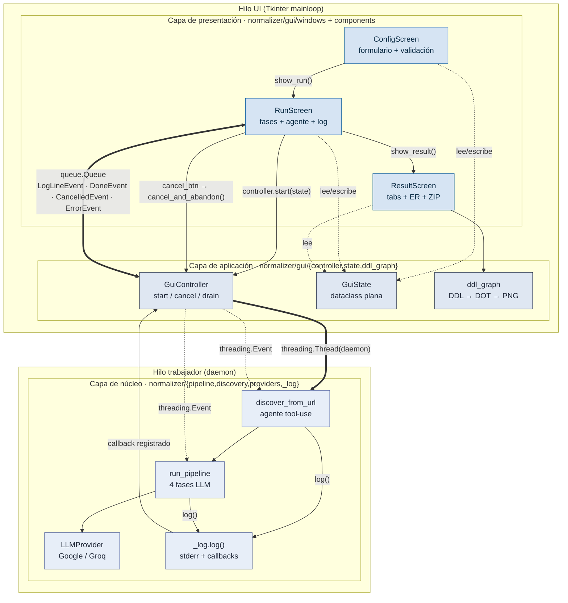

# Resumen GUI para reunión con tutores

Resumen denso de lo nuevo (la GUI, RU-7.2) centrado en **arquitectura y diseño**. Pensado para seguir el hilo en la reunión sin desviarse a UI cosmético. El detalle largo vive en `notes/gui-explicada.md`; este documento es el "hilo conductor".

---

## 1. Premisa de diseño

`normalizer/gui/` es un extra opcional (`pip install -e .[gui]`) sobre **CustomTkinter** que implementa RU-7.2. La premisa: **paridad funcional con la CLI sin duplicar lógica**. La GUI consume el mismo núcleo (`run_pipeline`, `discover_from_url`, `build_provider`) y solo aporta orquestación + visualización.

---

## 2. Arquitectura en tres capas



**Leyenda de aristas:**
- Flecha sólida fina → llamada directa (síncrona, mismo hilo).
- Flecha sólida gruesa (`==>`) → cruce de hilo (arranque del worker, cola de eventos).
- Flecha discontinua → lectura/escritura de estado compartido o señalización (`threading.Event`, callbacks de `_log`).

**Punto a defender:** el pipeline no sabe que existe la GUI. La GUI tampoco importa SDKs concretos (Google, Groq). Añadir un proveedor nuevo no toca ni una línea de presentación. La frontera entre hilos está concentrada en exactamente dos primitivas: una `queue.Queue` (worker → UI) y un `threading.Event` (UI → worker).

---

## 3. Modelo de concurrencia

Tkinter **no es thread-safe**, y el núcleo bloquea durante minutos en llamadas HTTP al LLM. Patrón aplicado:

- **Hilo UI**: bucle de eventos CTk, refresco cada 100 ms (`app.after(100, self._poll)`).
- **Hilo trabajador** (`daemon`): ejecuta `discover_from_url` + `run_pipeline` con un `threading.Event` como `cancel_event`.
- **Comunicación**: `queue.Queue` con eventos planos tipados (`LogLineEvent`, `DoneEvent`, `CancelledEvent`, `ErrorEvent`). El trabajador encola; la UI saca en cada tick.

---

## 4. Observabilidad reutilizando `_log`

Decisión clave: la GUI **no parsea stderr**. El módulo `normalizer/_log.py` ya emite `[mm:ss] mensaje` por stderr para la CLI; se le añadió un **registry de callbacks** (`register_callback`/`unregister_callback`). El controller registra el suyo, recibe cada línea tal cual la ve la CLI, e infiere fase del pipeline por prefijos (`Pipeline: ANÁLISIS …`, `Descubriendo evidencia`, `[iter N] ->`).

**Ventaja:** cualquier nueva instrumentación que se añada para depurar la CLI aparece automáticamente en la GUI.

---

## 5. Cancelación cooperativa de dos niveles

Es el detalle arquitectural más interesante:

- **Nivel núcleo** (`PipelineCancelled` en `pipeline.py`): el `cancel_event` se chequea entre fases, entre iteraciones del agente y entre tools del mismo turno. La llamada HTTP en curso **no se puede abortar** (los SDKs son síncronos y bloqueantes).
- **Nivel GUI** (`GuiController.cancel_and_abandon()`): pulsa el cancel **y** desvincula el callback del log + marca el controlador como "abandonado". La UI transita inmediatamente a la pantalla de resultado; el hilo huérfano sigue como `daemon` y muere cuando la llamada HTTP retorne, sin contaminar la pantalla siguiente.

Los artefactos ya escritos a disco se conservan — el usuario los ve igual.

---

## 6. Las tres pantallas

| Pantalla | Responsabilidad | Highlights |
|---|---|---|
| **`config.py`** | Formulario único: entrada (archivo/dir/URL), proveedor + dos modelos, credenciales | Listado dinámico del catálogo de modelos vía `LLMProvider.list_models()`; persistencia de API key en `.env` con `dotenv.set_key` (no toca el resto del fichero); botón "Abrir resultados existentes…" que salta directo a resultados sin re-ejecutar |
| **`run.py`** | Progreso por fases + iteraciones del agente + log | Una fila por fase con icono (`○●✓✗⏸`) y duración; tabla del agente solo en modo URL; cancelación responsiva |
| **`result.py`** | Banner de estado + tabview de artefactos + acciones | Pestañas: Descubrimiento / Análisis / Diseño / DDL / **Diagrama ER**; export ZIP; abrir directorio |

---

## 7. `ddl_graph.py` — diagrama ER auto-generado

Una pieza independiente que merece mencionarse:

- **Parser regex** sobre el DDL Oracle producido (pela el ` ```sql … ``` ` que a veces emite el LLM, parte `CREATE TABLE`, detecta FKs y PKs).
- **Selector de engine Graphviz** según topología: `sfdp` (force-directed) si hay hub (>10 FKs entrantes) o >20 tablas — el caso Habitica con `Users` como hub; `dot` (jerárquico LR) para grafos pequeños como Spruce.
- **Fallback gracioso**: si `dot` no está en PATH, busca rutas estándar de winget en Windows e inyecta en el PATH del proceso. Si tampoco encuentra, muestra instrucciones de instalación con un botón "Reintentar" que no requiere reiniciar la GUI.
- **Visor con zoom**: canvas Tk + scrollbars XY, resize **BILINEAR** (no LANCZOS — sobre el ER de Habitica 2896×2578 px LANCZOS tardaba 2-3 s por redraw), debounce de 80 ms para clicks rápidos en +/−, Ctrl+rueda para zoom.

---

## 8. Estado y aislamiento

`GuiState` es un `dataclass` con **solo tipos elementales** (cadenas, `Path`, listas, `PhaseInfo`). No contiene referencias a objetos del proveedor ni del agente — la capa de presentación nunca manipula esos objetos. Esto es lo que hace que swap entre pantallas sea trivial (destruir frame y empacar el siguiente) y que el estado sea inspeccionable sin riesgo.

---

## 9. Lo que la GUI **no** hace

Importante para no defender de más:

- No reimplementa el pipeline.
- No tiene su propio canal de logging.
- No conoce ningún SDK de LLM.
- No implementa RU-6 (refinamiento interactivo).

Cualquier extensión futura del núcleo (tercer proveedor, refinamiento, nuevas fases) aparece en la GUI sin tocar `gui/`.

---

## 10. Estado de verificación

- Verificación **programática** completa: todas las pantallas se construyen, flujo `log() → callback → cola → render` funciona, parser DDL → 11 tablas / 11 FKs sobre `out-facil/`.
- Verificación **interactiva con LLM real pendiente** del autor — es el siguiente paso bloqueante antes de la reunión (ver CLAUDE.md §2, punto 0 de "Siguiente").

---

## Punto fuerte si solo hay tiempo para uno

El **callback de `_log` + cola + cancelación de dos niveles**: resuelve thread-safety, observabilidad y responsividad con una sola pieza de diseño, y deja el núcleo intacto. Si los tutores preguntan "¿qué fue lo difícil?", esa es la respuesta.
